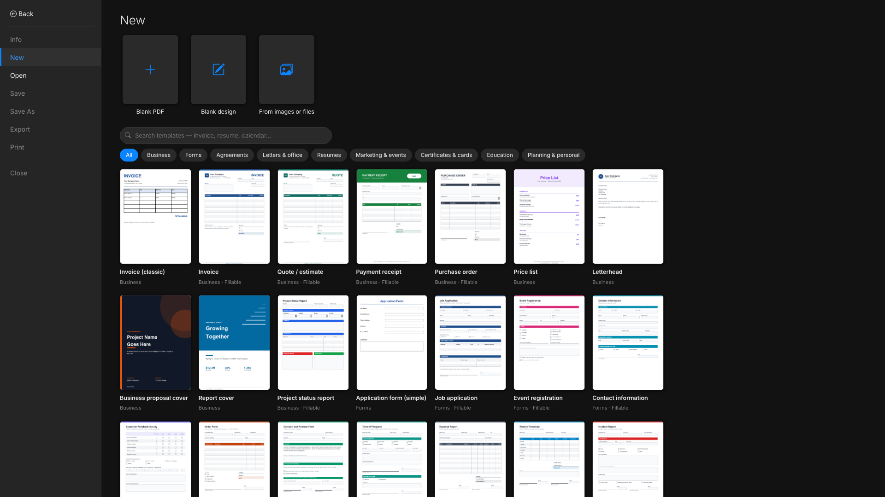
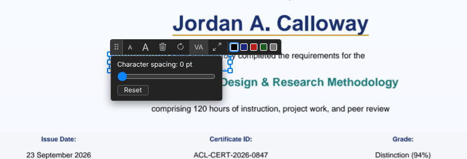
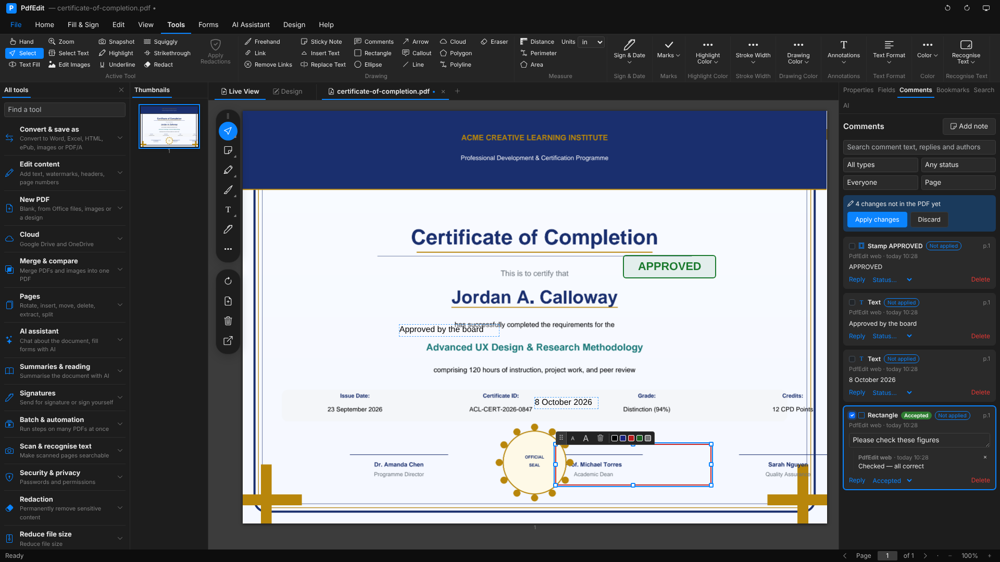
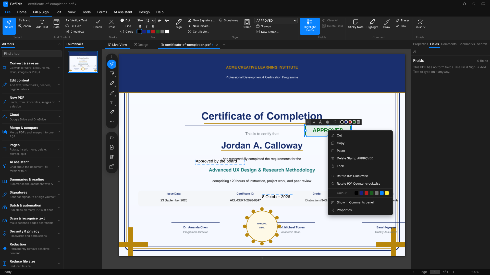
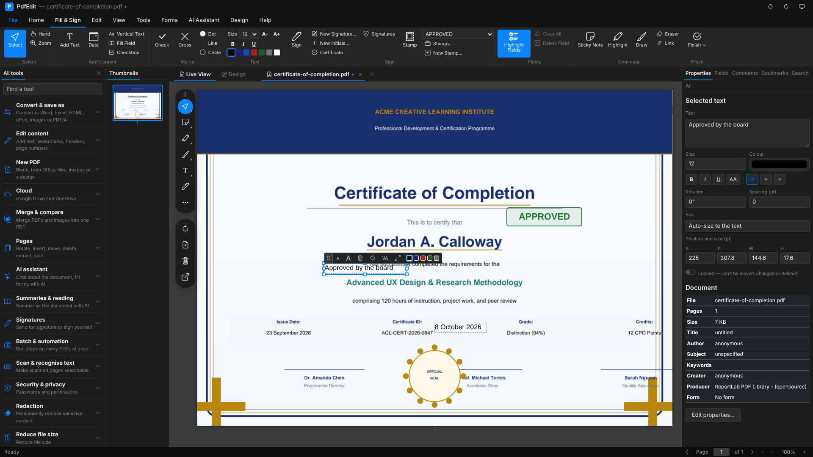
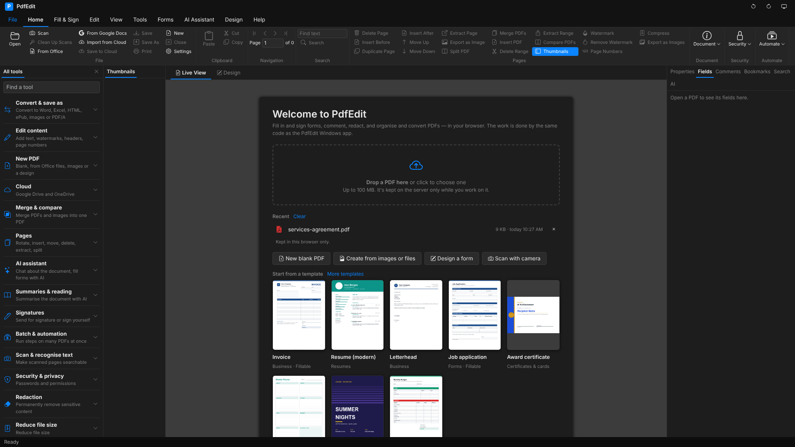
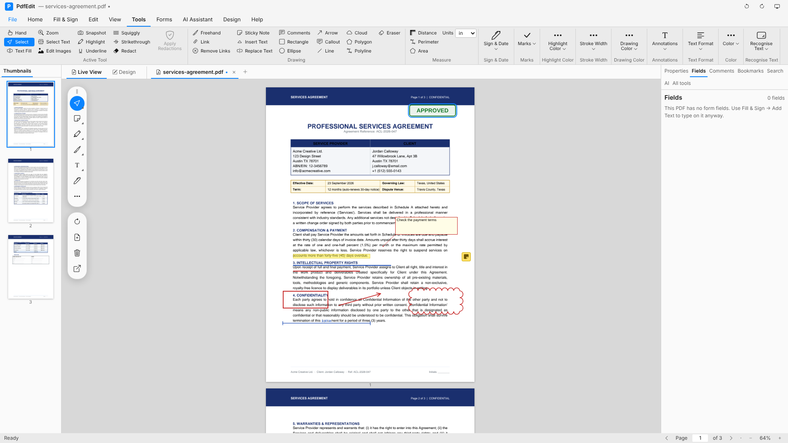
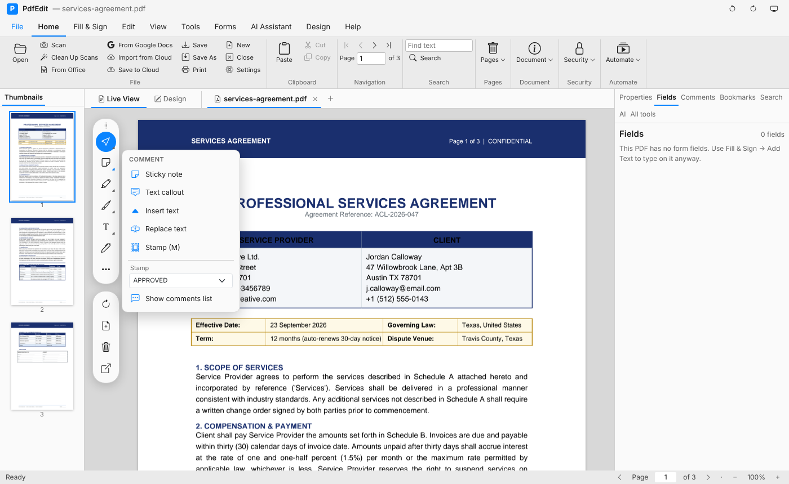
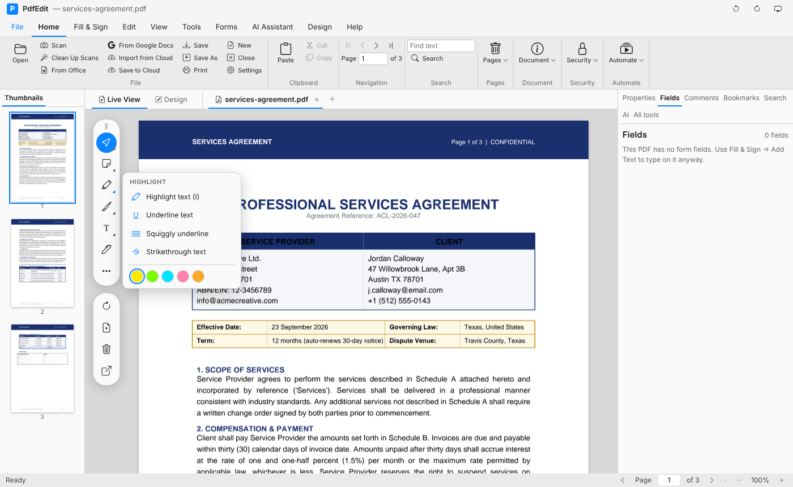

# PdfEdit for the web (Blazor)

The PdfEdit Windows app's window in the browser: a ribbon (File, Home, Fill & Sign, Edit, View,
Tools, Help), page thumbnails on the left, the pages in the middle, a side panel (Properties,
Fields, Comments, Bookmarks, Search) on the right and a blue status bar — in the same light and
dark colours. The PDF work runs on the server with the same libraries as the Windows app:
**PdfEdit.Core** (forms, annotations, page tools, export) and **PdfEdit.Render** (Pdfium).

```bash
dotnet run --project PdfEdit.Blazor
```

Then open the address it prints. With a checkout of the repository, the files in `Samples/` are
offered on the start page.

## Screenshots

<table>
  <tr>
    <td align="center"><br>Templates (File → New)</td>
    <td align="center"><br>Floating toolbar on anything you add</td>
    <td align="center"><br>Comments with review threads</td>
  </tr>
  <tr>
    <td align="center"><br>Right-click menus</td>
    <td align="center"><br>Properties and Lock</td>
    <td align="center"><br>Recent files and templates</td>
  </tr>
  <tr>
    <td align="center"><br>Tools tab and toolbox</td>
    <td align="center"><br>Comment tools</td>
    <td align="center"><br>Highlight tools</td>
  </tr>
  <tr>
    <td align="center"><br>Ribbon (groups fold into drop-downs)</td>
    <td align="center"><br>All tools, Dracula theme</td>
    <td align="center"><br>Office theme</td>
  </tr>
  <tr>
    <td align="center"><br>Select Text</td>
    <td align="center"><br>Edit Images</td>
    <td align="center"><br>Mind Map</td>
  </tr>
  <tr>
    <td align="center"><br>Design templates</td>
    <td align="center"><br>Take the Tour</td>
    <td></td>
  </tr>
  <tr>
    <td align="center"><br>Light</td>
    <td align="center"><br>Dark</td>
    <td align="center"><br>High contrast</td>
  </tr>
  <tr>
    <td align="center"><br>Floating toolbox</td>
    <td align="center"><br>Toolbox tools</td>
    <td align="center"><br>Saved signatures and initials</td>
  </tr>
  <tr>
    <td align="center"><br>More tools</td>
    <td align="center"><br>Design toolbox, grid and snap</td>
    <td></td>
  </tr>
  <tr>
    <td align="center"><br>Stamps, drawing and measuring</td>
    <td align="center"><br>Design a form</td>
    <td align="center"><br>Rotated pages and tabs</td>
  </tr>
  <tr>
    <td align="center"><br>Batch process</td>
    <td align="center"><br>Bulk fill</td>
    <td align="center"><br>Cloud storage</td>
  </tr>
  <tr>
    <td align="center"><br>Before Translate PDF</td>
    <td align="center"><br>After: layout and colours kept</td>
    <td></td>
  </tr>
</table>

## Themes

Light, Dark and High Contrast use the Windows app's colours exactly (PdfEdit/Themes/*.xaml), and
so do its other palettes — Office, Office Black, Dracula, Nord, One Dark, Monokai, Solarized Light,
Solarized Dark and GitHub Light (PdfEdit/Services/ThemeCatalog.cs). **System** follows the device's
dark-mode and high-contrast settings. Pick one on View → Theme or cycle with the button at the top
right; the choice is remembered in the browser.

## The ribbon

The ribbon has the Windows app's nine tabs — Home, Fill & Sign, Edit, View, Tools, Forms, AI
Assistant, Design and Help — with the same groups, in the same order, and every command that can
work in a browser. When the window is too narrow, groups fold into a drop-down button from the
right, as the Windows app's Fluent ribbon does. The **All tools** tab of the side panel lists every
feature by task, with a search box.

Left out, because a browser can't do them: scanning straight from a TWAIN/WIA scanner (Scan uses
your camera or photos instead), Check for Updates (the web version updates when the server does)
and "Use my Windows accent colour". Searching a folder of PDFs works by choosing the folder (or
the files) to upload.

## What it can do

| Area | Features |
|---|---|
| Templates | File → New is a gallery of 70 templates like Office's and Adobe's (business, fillable forms, agreements, letters, resumes, marketing, certificates and cards, education, planners and calendars) with search, categories, thumbnails and a large preview: customise one on the Design canvas or open it as a fillable PDF. The same catalog as the Windows app (File → New from Template) |
| Editing what you add | Everything you add stays editable after Apply changes, saving, page commands and reopening (PdfEdit's own annotations are read back from the PDF). A floating toolbar like the Windows app's (smaller / larger, delete, rotate, character spacing, fit box, swap mark, colours); resize from any edge or corner; arrow keys nudge (Shift: further); right-click menus for items, the page, form fields (align, distribute, same size) and links; Properties for the selected item (text, format, rotation, spacing, position and size, Lock — locked text keeps the PDF's Locked flag); dates change format, day, month and year in place |
| Drafts | Your work is kept in this browser (IndexedDB) as a draft every couple of seconds, and straight away with Save Draft (Home, Fill & Sign → Finish, Design): open documents with a copy of the PDF, everything placed on them but not applied yet, typed field values, moved or changed fields, and the Design canvas. Reloading the page, a dropped connection or a server restart brings it all back where you were; a draft from a closed window is listed on the start page under Unsaved drafts to carry on or discard. The status bar shows when it was last kept. Drafts stay in this browser only and are cleared after 14 days |
| Comments | Filter by type, status and reviewer, search and sort; each comment has a checkmark, a review status, a note and a reply thread, saved in the PDF the way the Windows app and Acrobat store them |
| File | Open (upload or samples; Word, Excel, PowerPoint, OpenDocument, text, Markdown and web pages are converted to PDF), recent files (kept in this browser), password-protected PDFs, New blank, Create from images/files, Save (download), Save As flattened / PDF/A / password-protected, Print, Export, Close |
| Fill & Sign | Fill every kind of form field, Add Text, Date, ticks, crosses and dots, draw or type a signature and place it, sticky notes, highlights, drag anything you've added to move it or its corner to resize it, works on rotated pages too (text, stamps and signatures are written upright), Apply Changes, Flatten & Download |
| Pages | Thumbnails with rotate and delete on hover, a right-click menu and drag to reorder; rotate, delete, insert blank before/after, duplicate, move up/down, extract or delete a range, split, merge PDFs and pictures, insert a PDF, export a page as an image |
| Document | Properties, watermark (add/remove), page numbers, header/footer, Bates numbers, compress, resize pages, pages per sheet, booklet, greyscale |
| Security | Password protect, remove hidden information, redaction (mark, then apply) |
| Edit | Undo/Redo for everything, export/import form data, reset form, check required fields, rectangles and ellipses |
| View | Several documents open at once as tabs above the pages (each keeps its unsaved work and place; closing one with changes asks first), zoom, fit width/page, thumbnails, side panel, bookmarks, comments, search with highlights, light/dark theme, statistics |
| Export | Word, Excel, PowerPoint, HTML, Markdown, ePub, text, page images, pictures |
| Prepare Form | Detect Fields on flat forms (named from their printed labels), add text, checkbox, radio, dropdown, list, date and signature fields by drawing them, select, drag to move, drag the corner to resize, Delete key, field properties (name, tooltip, required, read only, multi-line, alignment, font size, max characters, date and number formats) |
| Design | Live View / Design switch like the Windows app: design a form page from text, rectangles, ellipses, lines, arrows, tables, pictures, ticks and crosses, and text, multi-line, checkbox, radio, dropdown and signature fields; drag to move, drag the corner to resize, properties for each element, front/back, duplicate, delete, undo/redo; save and open .pdfdesign files (the same format as the Windows app), export a fillable PDF or open it straight in Live View |
| Scan & OCR | Recognise Text (OCR) adds an invisible text layer so scanned pages can be searched and copied (Tesseract on the server, any installed language), Scan with Camera turns phone or webcam photos — or pictures — into a PDF, optionally made searchable |
| Stamps, drawing & measuring | Stamps (Standard Business, Sign Here, Dynamic with your name and the time, and more) saved as real PDF stamps; freehand Draw with pen colour and width; lines and arrows; Measure distance, perimeter and area in inches, cm, mm or points with a live reading while you draw; stamps and drawings can be dragged to move or resized from the corner |
| Batch & bulk fill | Batch Process (Tools): run steps — OCR, compress, watermark, flatten, rotate, page numbers, header/footer, Bates numbers (continuing across files), remove hidden information, password, PDF/A, export text — over the open document and uploaded PDFs, download the results as a ZIP; Bulk Fill: one filled copy of the open form per row of a CSV or Excel sheet, fields matched to columns by name, file names from columns, optionally flattened, as a ZIP and/or one combined PDF |
| Cloud storage | Google Drive and OneDrive: sign in, browse folders and Shared with me, search, open PDFs (and Google Docs / Sheets / Slides as PDFs), save into a folder, Save Back over the opened file |
| Compare & Read Aloud | Compare PDFs: page-by-page difference pictures (red only in the old version, green only in the new, orange changed), the old and new pages, and the text lines that changed; Read Page / Read to End with the browser's voices, pause, stop, speed and voice |
| Certificate signing | Sign with Certificate using your .pfx / .p12 Digital ID or a new self-signed one (downloaded so you can reuse it): in an empty signature field, a box on the page or invisibly, with reason, location, contact, optional timestamp server, certify, and your drawn signature in the box; Check Signatures shows whether each signature is intact, trusted and what it covers. The Digital ID is only held in memory for the session |
| Floating toolbox | The quick-tools rail beside the pages, like the Windows app's: Select (Hand to pan, Marquee zoom), Comment (sticky note, text callout with a leader line, insert text, replace text, stamps with a picker, comments list), Highlight (highlight, underline, squiggly, strikethrough, with colours), Draw (freehand, rectangle, ellipse, arrow, line, cloud, polygon, polyline, eraser, with ink colours), Add text (text, tick, cross, dot, circle, line, date, vertical text, with mark colours), Sign (saved signatures and initials, add new, sign with certificate), More (measure with units, navigate, fill, shapes, form fields) and page tools (rotate, insert blank, delete, extract). Each group remembers the last tool picked; the corner arrow opens its options. In Design view it becomes the design toolbox: select, fill, sign, text, shapes, pen, picture, table, ticks, crosses, every field type, and a grid with snap. Single-letter shortcuts (V select, H hand, Z zoom, T text, I highlight, W draw, M stamp, D date, S sign, E edit fields) work when you're not typing in a box. Everything saves as real PDF annotations with their own appearance, so they show in any viewer |
| Saved signatures | Signatures and initials you draw or type can be kept for next time: they're stored in `pdfedit.db` (SQLite) in the app's folder, keyed by an anonymous ID kept in your browser, at most eight of each, and can be deleted from the Sign flyout. Set `PdfEdit:Database` to put the database somewhere else. Digital IDs and passwords are never stored |
| Matching the Windows ribbon | Home: Scan (camera), Clean Up Scans (blank pages, crooked scans, two-page spreads), From Google Docs (a shared link), Save As, Close, Settings, Cut / Copy / Paste (also a picture pasted from another app with Ctrl+V), First / Previous / Next / Last page, Extract Page, Delete / Extract Range, Crop Pages, Remove Password. Fill & Sign: Hand, Zoom, Vertical Text, Line and Circle marks, text size, A− / A+, bold, italic, underline and colours, New Initials, Stamps… (your own stamps, kept per browser), Highlight Fields, Clear All, Eraser, Link. Edit: Undo / Redo Ann., Delete, Find & Highlight, Import from JSON, Find & Replace in fields, Export to Other, Extract Images, Arrange Fields (align, space and size several fields: Ctrl+click to select). View: Rotate CW / CCW, Reset Rotation, All Pages, Slide Show, Two Pages, Auto Scroll, Night Mode, UI Scale, Add Bookmark, Attach File, Export / Import XFDF, Annotation Summary (CSV), Search PDFs (a folder), Visual Compare, Accessibility Check (with fixes). Tools: Select Text (copy, highlight, ask the AI), Edit Images, Snapshot, Remove Links, Callout, Cloud, Polygon, Polyline, highlight opacity, stroke width, text alignment and UPPERCASE. Forms tab. AI: Outline, Write (email, study notes, flashcards, quiz, FAQ, actions, plain English, social post), Ask by Voice (the browser's speech recognition), Ask Across PDFs (answers cite file and page), Design Form with AI, Mind Map, Fill Fields, Profiles and Quick Fill. Design: All Templates and the seven classic ones, Import PDF Page, text, shape, field and pen formats, Align (Ctrl+click several), Bring Forward / Send Backward, page size, grid, snap, background, zoom, position and size, Export Image (PNG or JPEG). Help: What's New, Tip of the Day, Take the Tour. Keyboard: Ctrl+X/C/V, Del, Ctrl+] / Ctrl+[, Ctrl+→ / Ctrl+←, Ctrl+Shift+= / −, F1 |
| Kept per browser | Settings (your name for dynamic stamps, date format, text size and colour, UI scale, Fit Width on open, field highlighting, tips at start), your own stamps and fill-in profiles are kept in `pdfedit.db` (SQLite) in the app's folder, under the browser's anonymous ID, like saved signatures. API keys, passwords and Digital IDs are never stored |
| AI Assistant | Chat about the open PDF with page links, Summarize, Extract data, Review contract, Find personal info, Translate, Fill form with AI, Translate PDF (every paragraph translated and written back in place, keeping the layout; Undo brings back the original), and the changes the AI proposes (fill fields, highlight, redact, notes, stamps, rotate, delete, watermark, bookmarks, commands) applied one by one or all at once |

Keyboard: Ctrl+O, Ctrl+S, Ctrl+Shift+S (Save As), Ctrl+P, Ctrl+Z, Ctrl+Y, Ctrl+F, Ctrl+G (go to page), Ctrl+W, Ctrl+plus/minus, Ctrl+0, Alt+Page Down / Up (next / previous document — browsers keep Ctrl+Tab), arrow keys to nudge, Esc.

## AI keys

The AI Assistant works with Claude, OpenAI, GitHub Copilot models or a local AI server (Ollama,
LM Studio …), through the same code as the Windows app. Each user can paste their own key in
**AI Assistant → API Keys**; it's kept only in memory for their session. To give everyone a key,
set it in the server's configuration — environment variables or `dotnet user-secrets`, never in a
committed file:

```bash
export PdfEdit__Ai__Provider=Claude          # Claude, OpenAI, Copilot or Local
export PdfEdit__Ai__ClaudeApiKey=...
export PdfEdit__Ai__OpenAiApiKey=...
export PdfEdit__Ai__GitHubToken=...
export PdfEdit__Ai__LocalEndpoint=http://localhost:11434/v1
export PdfEdit__Ai__LocalModel=llama3.2
```

## OCR

OCR uses the Tesseract program on the server (the same engine the Windows app bundles). Install
it with your package manager — for example `apt install tesseract-ocr`, plus
`tesseract-ocr-deu`, `tesseract-ocr-fra` … for more languages — or set
`PdfEdit__Ocr__TesseractPath` (and optionally `PdfEdit__Ocr__TessdataDir`). Without it the rest of
the site works and OCR says it isn't set up.

## Cloud storage

Home → **Open from Cloud** / **Save to Cloud** (and File → Open / Save As) work with Google Drive
and OneDrive: browse folders, search, open PDFs (Google Docs, Sheets and Slides, and Office files on
OneDrive, open as PDF copies), save a new file into a folder, and **Save Back** over the file you
opened. Each user signs in with their own account in a pop-up window; the sign-in is only kept in
memory for their session.

The server needs an OAuth app for each service you want to offer. Register
`https://your-site/cloud/callback` as the redirect address and put the details in the server's
configuration (environment variables or `dotnet user-secrets`, never a committed file):

```bash
# Google Cloud Console → APIs & Services → Credentials → OAuth client ID, type "Web application",
# with the Google Drive API enabled
export PdfEdit__Cloud__Google__ClientId=...apps.googleusercontent.com
export PdfEdit__Cloud__Google__ClientSecret=...
# Microsoft Entra → App registrations → platform "Web", a client secret, and the delegated
# permissions Files.ReadWrite, User.Read and offline_access
export PdfEdit__Cloud__OneDrive__ClientId=...
export PdfEdit__Cloud__OneDrive__ClientSecret=...
export PdfEdit__Cloud__OneDrive__Tenant=common     # or organizations, consumers, a tenant ID
```

A service with no client ID isn't offered. `PdfEdit__Cloud__TestServer` sends every cloud request
to a stand-in server instead, for testing.

## Office files

Word, Excel, PowerPoint and OpenDocument files are converted with LibreOffice on the server
(`apt install libreoffice-core libreoffice-writer libreoffice-calc libreoffice-impress`, or set
`PdfEdit__Office__LibreOfficePath` to its `soffice`). Without it, .docx files are still converted
by PdfEdit's own converter, and text, Markdown and web pages always are.

## How it works

- Each upload gets a temporary folder on the server; every change writes a new version of the
  file, so Undo and Redo step between versions. Uploads unused for two hours are deleted.
- Drafts: the open documents (the current PDF, items not applied yet, field values and field
  changes) and the Design canvas are kept in the browser's IndexedDB. When the page is reloaded the
  server keeps the documents for 15 minutes so the reload carries on with them, Undo included;
  after that, or after a server restart, the draft reopens from the PDF copy in the browser.
- Pages are drawn by Pdfium and served as PNGs (`/documents/{id}/pages/{n}.png`). Form fields are
  HTML inputs laid over the page; things you add stay editable until Apply Changes, Save or a
  page tool writes them into the PDF.

## Not in the web version yet

Scanning straight from a scanner: browsers can't reach TWAIN scanners, so use Scan (your camera)
or pictures instead. Check for Updates and the Windows accent colour are Windows-only too.
