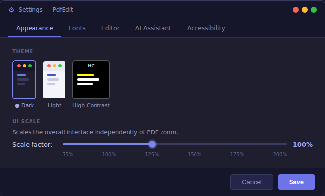

# PdfEdit — PDF Designer, Form Filler & Editor

A professional WPF desktop application for designing, editing, and filling PDF documents. Build PDFs from scratch with the design canvas, fill any form with AI assistance, annotate, sign, and manage pages — all in a native Windows application with an Office-style ribbon UI.

## Demo


*Open a PDF → fill form fields → AI Smart Fill → page management → theme switching*

---

## Screenshots

| Ribbon — Clipboard, Navigation & AI | Form Filling with AI Smart Fill |
|------|------|
|  |  |

| Dark Theme | Light Theme (IRS W-4) |
|------|------|
|  |  |

| AI Features | Settings |
|------|------|
|  |  |

---

## Why PdfEdit?

| Feature | PdfEdit | Adobe Acrobat | PDFfiller | Foxit PDF |
|---------|---------|---------------|-----------|-----------|
| Design canvas (build from scratch) | ✅ | ✅ | ❌ | ✅ |
| AI Smart Fill (auto-fill all fields) | ✅ Claude + GPT | ❌ | ❌ | ❌ |
| Built-in templates (Invoice, Letter…) | ✅ 7 templates | Limited | ✅ | ❌ |
| Table element | ✅ | ✅ | ❌ | ✅ |
| Watermark / Page Numbers | ✅ | ✅ | ✅ | ✅ |
| Bookmarks / Outline panel | ✅ | ✅ | ❌ | ✅ |
| Document Properties editor | ✅ | ✅ | ❌ | ✅ |
| Export pages as images (PNG) | ✅ | ✅ | ❌ | ✅ |
| Find & Replace in form fields | ✅ | ✅ | ❌ | ✅ |
| Required-field validation | ✅ | ✅ | ❌ | ❌ |
| PDF/A archival export | ✅ | ✅ | ❌ | ✅ |
| Free (open source) | ✅ | ❌ | ❌ | ❌ |
| WPF native (no browser) | ✅ | ✅ | ❌ | ✅ |
| Bring your own AI key | ✅ | ❌ | ❌ | ❌ |

---

## Feature Overview

### Design Canvas

Build PDFs from scratch with a word-processor-style canvas — no existing PDF required.

**Drawing Tools**
- **Text Box** — Click to place editable text; double-click to edit in-place; supports font family, size, bold/italic/underline, colour, background colour, and text alignment
- **Rectangle / Ellipse** — Draw filled or stroked shapes with configurable fill colour, stroke colour, stroke width, and corner radius
- **Line / Arrow** — Draw straight lines and arrows between points
- **Table** — Insert configurable tables with N rows × M columns; header row styled separately; border colour, thickness, and cell text editable
- **Pen (Freehand)** — Draw smooth freehand strokes at any thickness and colour
- **Image** — Insert PNG, JPG, BMP, GIF, or TIFF images; drag to resize

**Element Operations**
- **Select & Move** — Click any element to select it; drag to reposition; arrow keys for 1px nudge (Shift+arrow = 10px)
- **Resize** — 8-handle resize (NW/N/NE/W/E/SW/S/SE) with drag handles on the selection border
- **Copy / Paste** — Ctrl+C / Ctrl+V; paste creates an offset clone ready to position
- **Duplicate** — Ctrl+D to duplicate-in-place with 20px offset
- **Delete** — Del key or ribbon button
- **Undo / Redo** — Ctrl+Z / Ctrl+Y; unlimited history via state snapshot stacks
- **Select All** — Ctrl+A

**Alignment (relative to page)**
- Align Left Edge, Right Edge, Center Horizontally
- Align Top Edge, Bottom Edge, Center Vertically

**Layer Order**
- Bring Forward, Send Backward (one step)
- Bring to Front, Send to Back (full stack jump)

**Element Properties**
- **Opacity** — 0–100% slider per element; rendered in PDF export via ExtGState
- **Lock** — Prevent accidental move or resize; element still selectable
- **ZOrder** — Automatic layer tracking

**Templates** — One-click pre-built document layouts:
- **Invoice** — Logo, billing info, line-item table, total row, payment terms
- **Letter** — Professional letter with sender, date, recipient, and body sections
- **Form** — Labelled input fields for applications and surveys
- **Certificate** — Decorative bordered certificate with gold accents and signature lines
- **Business Card** — 85×54 mm card with two-tone background and contact details
- **Resume / CV** — Two-column professional CV with skills, experience, and education sections
- **Flyer** — Bold promotional flyer with headline, body text, and accent bar

**Pages & View**
- Page size: A4, Letter, A3, or Custom dimensions
- Grid overlay for alignment guides (20 px spacing)
- Zoom in/out (0.1× – 5×)
- Canvas scroll area with drop shadow and white page surface

**Export**
- **Export PDF** — Saves the full canvas to a PDF file via iText7
- **Open as PDF** — Exports to a temp file and immediately opens in the PDF viewer for filling/annotation
- Coordinate transform: WPF (Y-down) → PDF (Y-up) handled automatically

---

### PDF Form Filling

- **Visual Form Overlay** — Click any AcroForm field directly on the rendered page
- **All Field Types** — Text, checkboxes, radio buttons, combo boxes, list boxes, signature fields, password fields
- **Field Highlights** — Blue = optional, red = required, blue border = focused
- **Clear All Fields** — Reset all values in one click
- **Delete Field** — Remove individual AcroForm fields from the document
- **Import / Export** — Save and reload all field values as TSV files
- **Flatten & Save** — Bake filled values into a non-editable PDF
- **Find & Replace** — Search and replace text across all form field values; case-sensitive option
- **Validate Required Fields** — One-click check; lists empty required fields and navigates to the first one

---

### AI-Powered Document Analysis

- **Smart Fill** — AI reads the entire PDF and fills all form fields automatically — no prompting needed
- **Summarize** — Structured summary: overview, key parties, key dates, key amounts, main points
- **Extract Key Data** — Names, dates, addresses, amounts, reference numbers, contact info
- **Contract Analysis** — Parties, obligations, payment terms, termination clauses, risks
- **Find PII** — Locate all personally identifiable information for redaction review
- **Translate** — Translate document content to English or another target language
- **AI Chat with Document Context** — Ask any question grounded in the actual PDF text
- **Multi-Provider** — Connect Claude (Anthropic) or ChatGPT (OpenAI) with your own API key
- **Model Selection** — Claude Haiku 4.5 · Sonnet 5 · Opus 5 · GPT-4o mini · GPT-4o
- **Cancel** — Stop any in-progress AI response instantly
- **User Profiles** — Save personal data sets and auto-fill matching fields (no AI needed)
- **Secure Key Storage** — API keys stored in `%AppData%\PdfEdit\settings.json`; **passwords are never stored**

---

### Annotations & Signatures

**Free-Text Annotations**
- Add text anywhere on any page; rich formatting (font, size, bold, italic, underline, colour)
- Vertical text rotation (−90°); force uppercase mode
- Delete individual annotations before saving

**Signatures**
- Draw, type, or load signature images; preview thumbnails in the signature picker
- Place signatures anywhere on a page; remove before saving

---

### Page Management

- **Rotate Page** — CW / CCW; status bar shows cumulative rotation
- **Rotate All Pages** — Apply 90° rotation to every page at once
- **Move Page Up / Down** — Reorder pages via ribbon
- **Insert Page Before / After** — Add blank pages at any position
- **Delete Page** — Remove the current page (disabled on single-page documents)
- **Extract Page** — Save the current page as a standalone PDF
- **Merge PDF** — Append one or more PDFs to the current document
- **Insert PDF** — Insert another PDF at beginning, before/after current page, or end
- **Split PDF** — Split every page into individual files
- **Drag-and-Drop Reorder** — Drag thumbnails in the left panel to reorder pages
- **Right-Click Thumbnails** — Rotate CW/CCW, Move Up/Down, Insert Before/After, Delete, Extract
- **Watermark** — Diagonal text watermark on all pages (text, opacity, angle, font size, colour)
- **Page Numbers** — Footer on every page: "Page N of M" (left/centre/right, configurable format)
- **Compress PDF** — Re-save with `BEST_COMPRESSION` + smart mode; reports before/after file size
- **Export as Images** — Render every page to PNG at 192 DPI into a chosen folder
- **Archive (PDF/A)** — Save as PDF 1.4 with archival conformance metadata

---

### Document Management

- **Document Properties** — Edit PDF metadata: title, author, subject, keywords; shows creator, producer, page count, file size (File menu → Document Properties or Home tab)
- **Bookmarks / Outline** — Side panel shows the PDF outline tree; click any bookmark to navigate to its page

### Navigation & Viewing

- Page thumbnails panel (toggle from ribbon)
- Zoom: Ctrl+Scroll, ribbon buttons, fit-to-window, actual-size
- Page navigation: First, Previous, Next, Last, type page number directly
- Recent files in File menu
- Document state remembered per file (last page + zoom)
- Global search across field names, values, and annotations
- Bookmarks panel in Properties dock — click any heading to navigate
- Print via system dialog

---

### UI & Themes

- **Three Live Themes** — Dark, Light, and High Contrast (no restart required)
- **Fluent Ribbon** — Home, Fill & Sign, Forms, Tools, AI Assistant, **Design** tabs
- **Dockable Panels** — Properties, thumbnails, AI Chat via AvalonDock
- **Toast Notifications** — Success/info/warning/error with auto-dismiss
- **Themed Dialogs** — Error (expandable stack trace), Confirm (danger mode), Info
- **UI Scale** — Independent of zoom; 75%–200%
- **Drag & Drop** — Drag a PDF onto the window to open it

---

### Keyboard Shortcuts

| Action | Shortcut |
|--------|----------|
| Open | Ctrl+O |
| Save | Ctrl+S |
| Save As | Ctrl+Shift+S |
| Close | Ctrl+W |
| Print | Ctrl+P |
| Undo (design) | Ctrl+Z |
| Redo (design) | Ctrl+Y |
| Copy element | Ctrl+C |
| Paste element | Ctrl+V |
| Duplicate | Ctrl+D |
| Select All | Ctrl+A |
| Delete element | Del |
| Nudge 1px | Arrow keys |
| Nudge 10px | Shift+Arrow |
| Resize element 1px / 10px | Ctrl+Arrow / Ctrl+Shift+Arrow |
| Select tool | V |
| Text tool | T |
| Rectangle / Ellipse / Line | R / E / L |
| Arrow / Pen / Image | A / P / I |
| Table tool | B |
| Next page | Ctrl+Right |
| Previous page | Ctrl+Left |
| Zoom in | Ctrl+Add |
| Zoom out | Ctrl+Subtract |
| Fit to window | Ctrl+0 |
| Global search | Ctrl+Shift+F |

---

## Requirements

- Windows 10 (build 19041+) or Windows 11
- .NET 10 SDK (or Visual Studio 2022 17.12+)

## Building

```bash
cd PdfEdit
dotnet restore
dotnet build -c Release
dotnet run
```

Or open `PdfEdit.sln` in Visual Studio 2022 and press **F5**.

## Running Tests

```bash
cd PdfEdit.Tests
dotnet test
```

---

## Usage

**Filling an existing PDF:**
1. `File → Open` (Ctrl+O) or drag a PDF onto the window
2. Click any form field on the page and type or select a value
3. For AI-powered fill: **AI Assistant** tab → **Smart Fill**
4. Add text annotations: **Fill & Sign** tab → **Add Text** → click anywhere
5. Add your signature: **Fill & Sign** tab → **Signatures** → draw or type → place on page
6. Save with Ctrl+S (fields remain editable) or **Flatten & Save** to bake them in permanently

**Building a PDF from scratch:**
1. Click the **Design** tab in the ribbon
2. Click **New Design** to open the canvas
3. Choose a **Template** (Invoice, Letter, Form, Certificate, Business Card) or start blank
4. Add elements: **Text Box**, **Rectangle**, **Ellipse**, **Table**, **Image**, **Pen**
5. Select, move, and resize elements; use **Align** tools to position precisely
6. **Export PDF** or **Open as PDF** to view and fill in the PDF viewer

---

## Architecture

| Layer | Description |
|-------|-------------|
| `Services/PdfRenderService` | Renders pages to `BitmapSource` via `Windows.Data.Pdf` |
| `Services/PdfFormService` | Reads/writes AcroForm fields; splits, merges, reorders, rotates, inserts pages; watermark; page numbers; compression; metadata; bookmarks; redaction; PDF/A export via iText7 |
| `Services/PdfTextExtractorService` | Extracts text from PDF pages via iText7; cached per page for AI context |
| `Services/AiProviderService` | Streaming HTTP client for Claude and OpenAI; document analysis prompt builder |
| `Services/DesignExportService` | Renders DesignCanvas elements to a PDF page via iText7; handles WPF→PDF coordinate transform, opacity, and table layout |
| `Services/ToastService` | Singleton event-based toast notification bus |
| `Services/AppSettings` | Loads/saves `%AppData%\PdfEdit\settings.json` (API keys, theme, recent files, UI scale) |
| `Services/PersonalProfileStore` | Profile storage and keyword-based field matching for Quick Fill |
| `ViewModels/MainViewModel` | MVVM — all commands, page state, rotation, field values, AI orchestration, design mode |
| `ViewModels/DesignCanvasViewModel` | Design canvas state: elements, tools, selection, format, undo/redo, alignment, templates |
| `Models/DesignElement` | Element hierarchy: `TextDesignElement`, `ShapeDesignElement`, `ImageDesignElement`, `FreehandDesignElement`, `TableDesignElement` |
| `Controls/DesignCanvas` | WPF canvas with ItemsControl, InkCanvas, 8-handle resize thumbs, rubber-band preview, mouse draw |
| `Controls/PdfViewerControl` | Renders the page image and overlays live form controls |
| `Controls/PageThumbnailsPanel` | Left thumbnail strip with drag-and-drop reorder |
| `Controls/AiChatPanel` | AI chat UI — model picker, provider tabs, preset chips, streaming |
| `Dialogs/AppDialog` | Themed dialogs replacing `MessageBox.Show` |
| `Dialogs/DocumentPropertiesDialog` | Edit PDF metadata (title, author, subject, keywords); shows read-only info |
| `Dialogs/FindReplaceFieldsDialog` | Find & replace text across form field values with case-sensitive option |
| `Dialogs/WatermarkDialog` | Watermark configuration: text, font size, opacity, angle, colour |
| `Dialogs/ShortcutsDialog` | Scrollable keyboard shortcut reference (F1) |
| `Models/BookmarkItem` | Hierarchical PDF outline node (title, page number, children) |
| `Models/PdfMetadataInfo` | PDF metadata DTO (title, author, subject, keywords, creator, producer, page count) |
| `Resources/AppTheme.xaml` | `DynamicResource` token-based style system for live theme switching |

---

## Key Packages

| Package | Use |
|---------|-----|
| `itext7` v8 | PDF AcroForm, text extraction, page manipulation, canvas drawing |
| `Fluent.Ribbon` v10 | Office-style ribbon toolbar |
| `AvalonDock` (Dirkster) v5 | Dockable panels |
| `Windows.Data.Pdf` (built-in) | High-quality PDF page rendering |
| `System.Text.Json` (built-in) | Settings and AI API serialisation |
| `xunit` v2 | Unit test framework |

---

## Security

- API keys stored in `%AppData%\PdfEdit\settings.json` (local machine only)
- **Passwords are never stored** — password-type PDF fields use a `PasswordBox`; values written only to the PDF at save time
- Keys sent only to the selected AI provider's public API endpoints; never shared with third parties
- No telemetry; no analytics; no network requests other than to the AI provider you configure
