# PdfEdit — PDF Designer, Form Filler & Editor

A professional WPF desktop application for designing, editing, and filling PDF documents on Windows. Build PDFs from scratch with the design canvas, fill any form with AI assistance, annotate, sign, and manage pages — all in a native Windows application with an Office-style ribbon UI.

---

## Demo

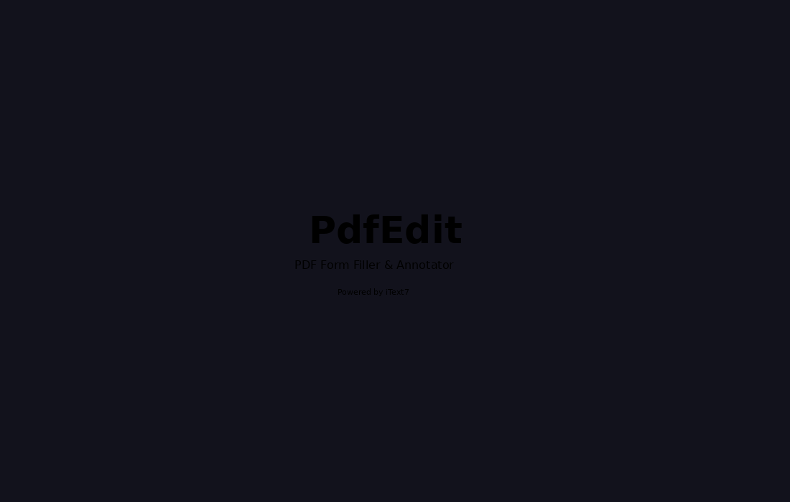

> **Video walkthrough:** A full narrated product demo video is coming soon.
> See [`docs/demo-video-script.md`](docs/demo-video-script.md) for the storyboard.
> <!-- TODO: replace with real YouTube embed once recorded -->

---

## Download & Install

| Installer | Platform | Notes |
|-----------|----------|-------|
| **EXE Setup** (`PdfEditSetup-1.0.0.exe`) | Windows 10/11 x64 | Detects & installs .NET 10 automatically |
| **MSIX Package** (`PdfEdit-1.0.0.0.msix`) | Windows 10/11 x64 | Modern packaging; requires .NET 10 Desktop Runtime |

### Requirements

- Windows 10 v2004 (build 19041) or later, 64-bit
- [.NET 10 Desktop Runtime](https://dotnet.microsoft.com/download/dotnet/10.0) — the EXE installer downloads it for you if missing

### Building the installers yourself

```powershell
# Full build (publishes app + builds EXE + builds MSIX)
pwsh installer\build-installer.ps1

# EXE only
pwsh installer\build-installer.ps1 -SkipMsix

# MSIX only (skips dotnet publish if already done)
pwsh installer\build-installer.ps1 -SkipPublish -SkipInno
```

Requires [Inno Setup 6](https://jrsoftware.org/isinfo.php) for the EXE and the Windows SDK (`makeappx.exe`) for the MSIX.

---

## Screenshots

| Dark Theme — Form Filling | Light Theme (IRS W-4) |
|---|---|
| 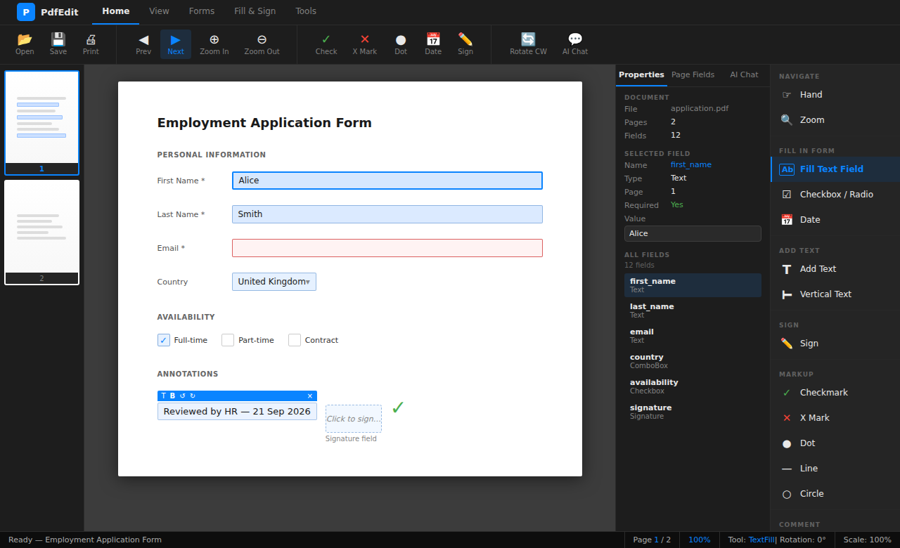 | 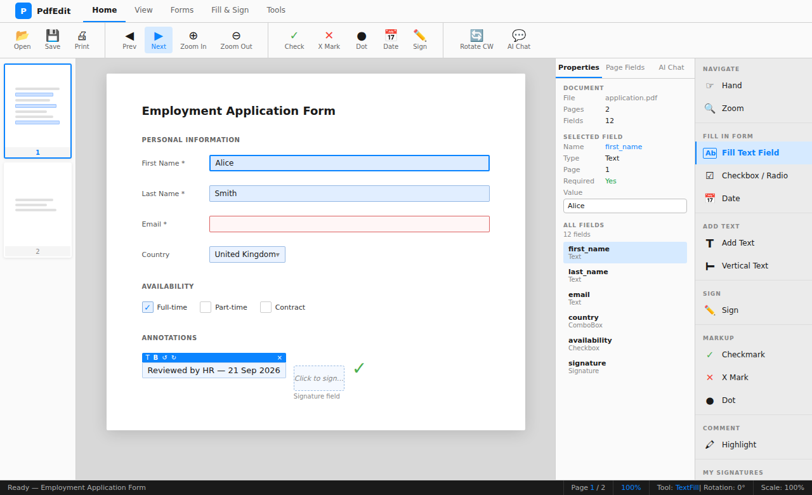 |

| Live View — PDF Annotations & Callouts | Design Canvas — Invoice Template |
|---|---|
| 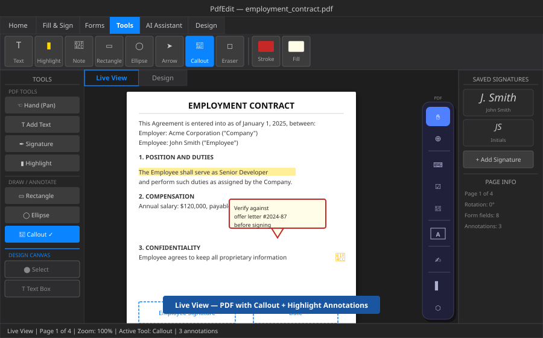 | 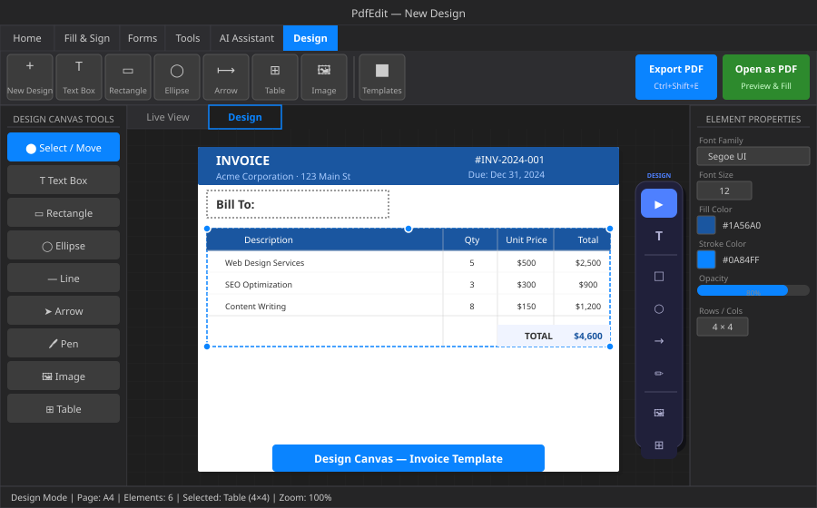 |

| High Contrast Theme | Page Management |
|---|---|
| 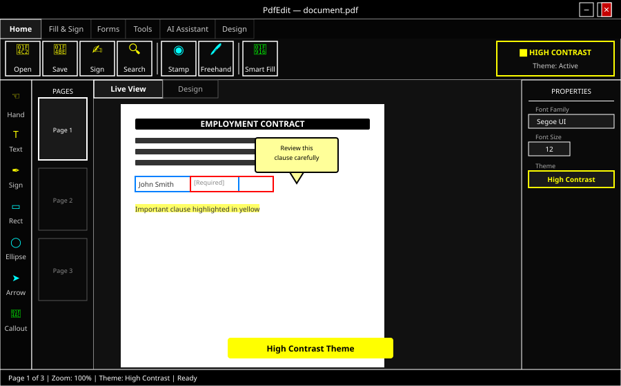 | 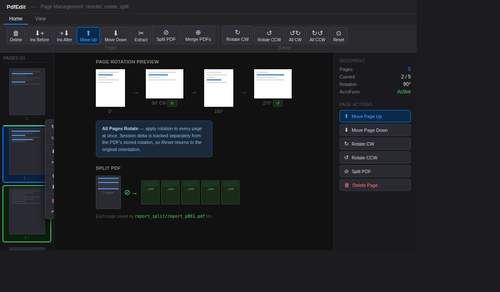 |

| AI Features | Settings & Accessibility |
|---|---|
| 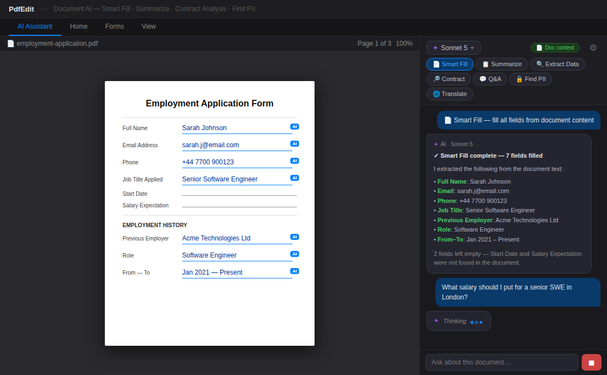 | 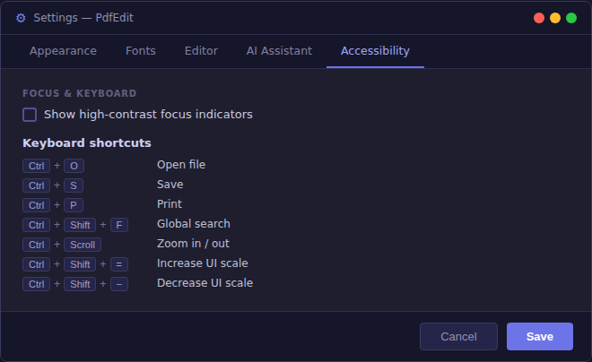 |

| Render Engine Settings | Form Filling |
|---|---|
| 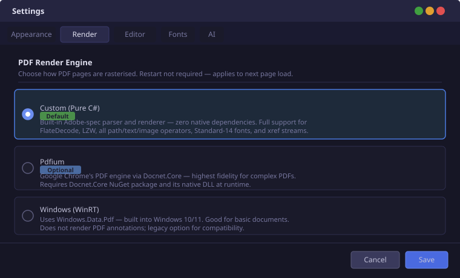 | 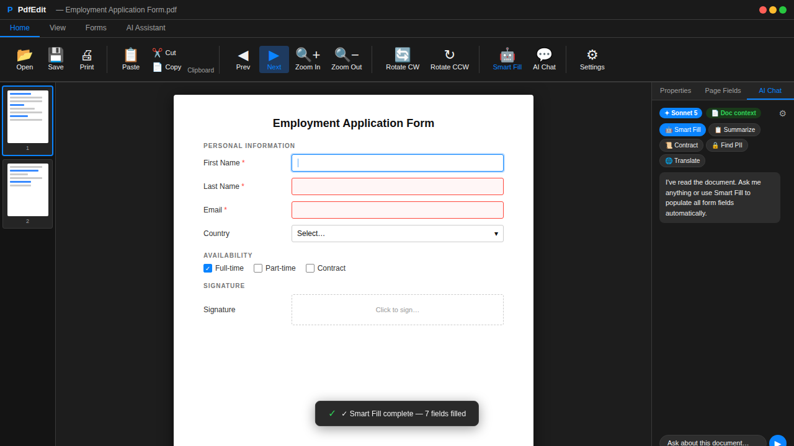 |

| Ribbon Icons | |
|---|---|
| 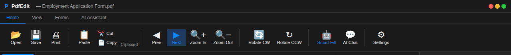 | |

---

## Why PdfEdit?

| Feature | PdfEdit | Adobe Acrobat | PDFfiller | Foxit PDF |
|---------|---------|---------------|-----------|-----------|
| Built-in pure-C# PDF renderer (zero native deps) | ✅ | ❌ | ❌ | ❌ |
| Design canvas (build PDF from scratch) | ✅ | ✅ | ❌ | ✅ |
| AI Smart Fill (auto-fill all fields) | ✅ Claude + GPT | ❌ | ❌ | ❌ |
| Built-in templates (Invoice, Letter…) | ✅ 7 templates | Limited | ✅ | ❌ |
| Table element | ✅ | ✅ | ❌ | ✅ |
| Watermark / Page Numbers | ✅ | ✅ | ✅ | ✅ |
| Bates Numbering | ✅ | ✅ | ❌ | ✅ |
| Bookmarks / Outline panel | ✅ | ✅ | ❌ | ✅ |
| Document Properties editor | ✅ | ✅ | ❌ | ✅ |
| Password Protect / Encrypt (AES-256) | ✅ | ✅ | ✅ | ✅ |
| Crop Pages | ✅ | ✅ | ❌ | ✅ |
| Header / Footer | ✅ | ✅ | ✅ | ✅ |
| Highlight / Underline / Strikethrough | ✅ | ✅ | ✅ | ✅ |
| Sticky Note annotations | ✅ | ✅ | ✅ | ✅ |
| Redaction (burn-in) | ✅ | ✅ | ❌ | ✅ |
| Freehand Ink Annotations | ✅ | ✅ | ✅ | ✅ |
| Hyperlink Annotations | ✅ | ✅ | ❌ | ✅ |
| Form Field Creator (draw new fields) | ✅ | ✅ | ❌ | ✅ |
| Compare PDFs (text diff) | ✅ | ✅ | ❌ | ✅ |
| Export pages as images (PNG) | ✅ | ✅ | ❌ | ✅ |
| Export PDF text to TXT | ✅ | ✅ | ❌ | ✅ |
| Delete / Extract page range | ✅ | ✅ | ✅ | ✅ |
| Find & Replace in form fields | ✅ | ✅ | ❌ | ✅ |
| Find text & highlight all matches | ✅ | ✅ | ❌ | ✅ |
| XFDF annotation export / import | ✅ | ✅ | ❌ | ✅ |
| Annotation summary (CSV export) | ✅ | ❌ | ❌ | ❌ |
| Required-field validation | ✅ | ✅ | ❌ | ❌ |
| PDF/A archival export | ✅ | ✅ | ❌ | ✅ |
| Rubber Stamps (APPROVED, DRAFT…) | ✅ 10 + custom | ✅ | ❌ | ✅ |
| Custom stamp creation | ✅ | ❌ | ❌ | ❌ |
| File Attachments (embed/extract) | ✅ | ✅ | ❌ | ✅ |
| Annotation Undo / Redo | ✅ | ✅ | ❌ | ✅ |
| Shape annotations (rect/ellipse/arrow) | ✅ | ✅ | ❌ | ✅ |
| Callout (speech bubble) annotations | ✅ | ✅ | ❌ | ✅ |
| Shape fill color | ✅ | ✅ | ❌ | ✅ |
| Eraser tool | ✅ | ✅ | ❌ | ✅ |
| Separate Live View / Design Canvas tabs | ✅ | ✅ | ❌ | ✅ |
| Unified toolbox auto-switches view | ✅ | ❌ | ❌ | ❌ |
| Radio button form field creator | ✅ | ✅ | ❌ | ✅ |
| Highlight opacity control | ✅ | ✅ | ❌ | ✅ |
| Separate drawing / highlight color | ✅ | ✅ | ❌ | ✅ |
| Document Statistics (word/annotation count) | ✅ | ✅ | ❌ | ✅ |
| Import form data from JSON | ✅ | ❌ | ❌ | ❌ |
| Free (open source) | ✅ | ❌ | ❌ | ❌ |
| WPF native (no browser/Electron) | ✅ | ✅ | ❌ | ✅ |
| Bring your own AI key | ✅ | ❌ | ❌ | ❌ |

---

## Feature Overview

### Design Canvas

Build PDFs from scratch with a word-processor-style canvas — no existing PDF required.

**Drawing Tools**
- **Text Box** — Click to place editable text; double-click to edit in-place; supports font family, size, bold/italic/underline, colour, background colour, and text alignment
- **Rectangle / Ellipse** — Draw filled or stroked shapes with configurable fill colour, stroke colour, stroke width, and corner radius
- **Line / Arrow** — Draw straight lines and arrows between points
- **Table** — Insert configurable tables with N rows × M columns; header row styled separately; border colour, thickness, and cell text editable
- **Pen (Freehand)** — Draw smooth freehand strokes at any thickness and colour
- **Image** — Insert PNG, JPG, BMP, GIF, or TIFF images; drag to resize

**Element Operations**
- **Select & Move** — Click any element to select it; drag to reposition; arrow keys for 1px nudge (Shift+arrow = 10px)
- **Resize** — 8-handle resize (NW/N/NE/W/E/SW/S/SE) with drag handles on the selection border
- **Copy / Paste** — Ctrl+C / Ctrl+V; paste creates an offset clone ready to position
- **Duplicate** — Ctrl+D to duplicate-in-place with 20px offset
- **Delete** — Del key or ribbon button
- **Undo / Redo** — Ctrl+Z / Ctrl+Y; unlimited history via state snapshot stacks
- **Select All** — Ctrl+A

**Alignment (relative to page)**
- Align Left Edge, Right Edge, Center Horizontally
- Align Top Edge, Bottom Edge, Center Vertically

**Layer Order**
- Bring Forward, Send Backward (one step)
- Bring to Front, Send to Back (full stack jump)

**Element Properties**
- **Opacity** — 0–100% slider per element; rendered in PDF export via ExtGState
- **Lock** — Prevent accidental move or resize; element still selectable
- **ZOrder** — Automatic layer tracking

**Templates** — One-click pre-built document layouts:
- **Invoice** — Logo, billing info, line-item table, total row, payment terms
- **Letter** — Professional letter with sender, date, recipient, and body sections
- **Form** — Labelled input fields for applications and surveys
- **Certificate** — Decorative bordered certificate with gold accents and signature lines
- **Business Card** — 85×54 mm card with two-tone background and contact details
- **Resume / CV** — Two-column professional CV with skills, experience, and education sections
- **Flyer** — Bold promotional flyer with headline, body text, and accent bar

**Pages & View**
- Page size: A4, Letter, A3, or Custom dimensions
- Grid overlay for alignment guides (20 px spacing)
- Zoom in/out (0.1× – 5×)
- Canvas scroll area with drop shadow and white page surface

**Export**
- **Export PDF** — Saves the full canvas to a PDF file via iText7
- **Open as PDF** — Exports to a temp file and immediately opens in the PDF viewer for filling/annotation
- Coordinate transform: WPF (Y-down) → PDF (Y-up) handled automatically

---

### PDF Form Filling

- **Visual Form Overlay** — Click any AcroForm field directly on the rendered page
- **All Field Types** — Text, checkboxes, radio buttons, combo boxes, list boxes, signature fields, password fields
- **Field Highlights** — Blue = optional, red = required, blue border = focused; toggle from ribbon
- **Clear All Fields** — Reset all values in one click
- **Delete Field** — Remove individual AcroForm fields from the document
- **Import / Export** — Save and reload all field values as TSV files
- **Flatten & Save** — Bake filled values into a non-editable PDF
- **Find & Replace** — Search and replace text across all form field values; case-sensitive option
- **Validate Required Fields** — One-click check; lists empty required fields and navigates to the first one

### Form Field Creator

Draw new fillable form fields onto any PDF (even scanned, non-form PDFs):

- **Text Field** — Drag a rectangle; enter field name; adds an editable AcroForm text field
- **Checkbox** — Drag a square; enter field name; adds a checkbox field
- **Combo Box** — Drag a rectangle; enter field name and dropdown choices (one per line)
- **Radio Button** — Drag a square; enter a group name; multiple fields with the same group name form an exclusive radio group
- All new fields are immediately saved to the PDF and available for filling

### Security

- **Password Protect** — Encrypt the PDF with AES-256; set open password (required to open), owner password (required to change permissions), and choose whether to allow printing and/or copying
- **Remove Password** — Strip encryption from an already-open (unlocked) PDF
- **Passwords are NEVER stored** — entered only at protect/open time, written to the PDF, never cached to disk

---

### AI-Powered Document Analysis

- **Smart Fill** — AI reads the entire PDF and fills all form fields automatically — no prompting needed
- **Summarize** — Structured summary: overview, key parties, key dates, key amounts, main points
- **Extract Key Data** — Names, dates, addresses, amounts, reference numbers, contact info
- **Contract Analysis** — Parties, obligations, payment terms, termination clauses, risks
- **Find PII** — Locate all personally identifiable information for redaction review
- **AI Chat with Document Context** — Ask any question grounded in the actual PDF text
- **Multi-Provider** — Connect Claude (Anthropic) or ChatGPT (OpenAI) with your own API key
- **Model Selection** — Claude Haiku 4.5 · Sonnet 5 · Opus 5 · GPT-4o mini · GPT-4o
- **Cancel** — Stop any in-progress AI response instantly
- **User Profiles** — Save personal data sets and auto-fill matching fields (no AI needed)
- **Secure Key Storage** — API keys stored in `%AppData%\PdfEdit\settings.json`; **passwords are never stored**

---

### Annotations & Signatures

**Free-Text Annotations**
- Add text anywhere on any page; rich formatting (font, size, bold, italic, underline, colour)
- Vertical text rotation (−90°); force uppercase mode
- Drag the toolbar grip to reposition; Delete key or right-click to remove

**Highlight / Underline / Strikethrough**
- Drag to draw on any page; five colours: Yellow, Green, Blue, Pink, Orange (picker in ribbon)
- Stored as standard PDF highlight/underline/strikethrough annotations on save
- Right-click any highlight to delete it

**Sticky Notes**
- Click anywhere on a page to place a sticky note pin 📌
- Enter note text and author name; choose colour (yellow, green, blue, pink)
- Tooltip shows the note preview; right-click to view full text or delete
- Saved as standard PDF text (comment) annotations — readable in any PDF viewer

**Redaction**
- Drag to mark sensitive regions with a black box
- **Apply Redactions** permanently burns the boxes into the PDF (irreversible)
- Right-click a redaction box to remove it before applying

**Ink / Freehand Draw**
- Draw smooth ink strokes with the Freehand tool
- Colour follows the Highlight Color picker; stored as PDF ink annotations on save
- Right-click any stroke to delete it

**Rubber Stamps**
- 10 built-in stamps: APPROVED, CONFIDENTIAL, DRAFT, FINAL, FOR REVIEW, NOT APPROVED, RECEIVED, REJECTED, REVISED, VOID
- Placed as rotated free-text annotations on the page

**Shape Annotations**
- **Rectangle / Ellipse** — Drag to draw stroked shape annotations; configurable stroke colour and width
- **Arrow** — Drag to draw arrow annotations; saved as PDF line annotations with arrowhead
- **Callout** — Drag to place a speech-bubble callout box; enter text when prompted; saved as a standard PDF `FreeTextAnnotation` with callout line (`IT=FreeTextCallout`); default light-yellow fill
- Right-click any shape to delete it
- Supports annotation Undo/Redo (Ctrl+Z / Ctrl+Y)

**Eraser Tool**
- Click or drag over any annotation to erase it
- Works on freehand ink strokes, shape annotations, and placed glyphs

**Hyperlink Annotations**
- Link tool: drag a rectangle, enter a URL — creates a clickable PDF link annotation
- Supports http://, https://, and mailto: schemes

**Checkmarks, X Marks, Dots, Lines, Circles**
- Single-click stamps for form checking workflows

**Signatures**
- Draw, type, or load signature images; preview thumbnails in the signature picker
- Place signatures anywhere on a page; remove before saving

**XFDF Annotation Export / Import**
- Export all annotations (highlights, sticky notes, free text, shapes) to an XFDF file — the industry-standard Adobe annotation interchange format
- Import XFDF files from Adobe Acrobat, Foxit PDF, or other compliant PDF viewers
- Keyboard shortcuts: Ctrl+Shift+E (export), Ctrl+Shift+I (import)

**Annotation Summary Export**
- Export all annotations to a CSV file for review workflows, auditing, or further processing in Excel
- Includes type, page number, coordinates, colour, and text content

**Find Text and Highlight**
- Search for any text string across the entire PDF and instantly create highlight annotations on every match
- Accurate position extraction using iText7's `RegexBasedLocationExtractionStrategy`
- All matches are added as a single undo-able action

---

### Page Management

- **Rotate Page** — CW / CCW; status bar shows cumulative rotation
- **Rotate All Pages** — Apply 90° rotation to every page at once
- **Move Page Up / Down** — Reorder pages via ribbon
- **Duplicate Page** — Copies current page and inserts the copy immediately after it
- **Insert Page Before / After** — Add blank pages at any position
- **Delete Page** — Remove the current page (disabled on single-page documents)
- **Delete Page Range** — Delete any range of pages by first/last page number
- **Extract Page** — Save the current page as a standalone PDF
- **Extract Page Range** — Extract any range of pages to a new PDF
- **Merge PDF** — Append one or more PDFs to the current document
- **Insert PDF** — Insert another PDF at beginning, before/after current page, or end
- **Split PDF** — Split every page into individual files
- **Drag-and-Drop Reorder** — Drag thumbnails in the left panel to reorder pages
- **Right-Click Thumbnails** — Rotate CW/CCW, Move Up/Down, Insert Before/After, Delete, Extract
- **Compare PDFs** — Side-by-side text diff of two PDFs; shows added/removed lines per page
- **Watermark** — Diagonal text watermark on all pages (text, opacity, angle, font size, colour)
- **Page Numbers** — Footer on every page: "Page N of M" (left/centre/right, configurable format)
- **Header / Footer** — Custom text top/bottom of every page; font size and alignment (L/C/R)
- **Bates Numbers** — Sequential numbers (with prefix, suffix, digit padding) at any corner or centre; legal document workflow
- **Crop Pages** — Set per-edge crop margins (in points) applied as CropBox on all pages
- **Compress PDF** — Re-save with `BEST_COMPRESSION` + smart mode; reports before/after file size
- **Export as Images** — Render every page to PNG at 192 DPI into a chosen folder
- **Export Text** — Extract all text from the PDF and save to a UTF-8 `.txt` file
- **Archive (PDF/A)** — Save as PDF 1.4 with archival conformance metadata

---

### File Attachments

Embed and manage attached files within the PDF document:

- **Attach File** — Embed any file into the PDF's portable attachment collection (View tab → Attachments)
- **Extract File** — Save an embedded attachment to disk
- **Remove Attachment** — Delete an embedded file from the PDF
- Attachments panel in the sidebar shows name, file size, and per-attachment actions
- Embedded files travel with the PDF — useful for attaching source data, supporting documents, or reference files

### Document Management

- **Document Properties** — Edit PDF metadata: title, author, subject, keywords; shows creator, producer, page count, file size (File menu → Document Properties or Home tab)
- **Bookmarks / Outline** — Side panel shows the PDF outline tree; click any bookmark to navigate to its page

### Navigation & Viewing

- Page thumbnails panel (toggle from ribbon)
- Zoom: Ctrl+Scroll, ribbon buttons, fit-to-window, actual-size
- Page navigation: First, Previous, Next, Last, type page number directly
- Recent files in File menu
- Document state remembered per file (last page + zoom)
- Global search across field names, values, and annotations
- Bookmarks panel in Properties dock — click any heading to navigate
- Print via system dialog

---

### Render Engine

PdfEdit ships three interchangeable PDF renderers, selectable in **Settings → Render Engine**:

| Engine | Technology | Quality | Dependencies |
|--------|-----------|---------|--------------|
| **Custom (default)** | Pure C# — built-in PDF parser and renderer | Native WPF vector/text output | None (zero native DLLs) |
| **Pdfium** | Google Chrome's PDF engine via Docnet.Core | Chrome/Adobe-quality rasterisation | `Docnet.Core` NuGet + native DLL |
| **Windows (WinRT)** | `Windows.Data.Pdf` OS API | Good for basic documents | Built-in (Windows 10+) |

The Custom engine is a full Adobe-spec PDF implementation written entirely in C#:
- **Parser** — xref tables, xref streams (PDF 1.5+), object streams (ObjStm), cross-reference caching
- **Stream filters** — FlateDecode (zlib + all 5 PNG predictors + TIFF horizontal), LZW, ASCII85, ASCIIHex, RunLength, DCT/JPX passthrough
- **Content renderer** — all standard path, paint, color, text, and XObject operators
- **Font handling** — Standard-14 font map, ToUnicode CMap, WinAnsi (CP1252), /Differences glyph table
- **Images** — JPEG (native passthrough), raw RGB/CMYK/Gray bitmaps, inline images (BI…ID…EI)

---

### UI & Themes

- **Three Live Themes** — Dark, Light, and High Contrast (no restart required)
- **Fluent Ribbon** — Home, Fill & Sign, Forms, Tools, AI Assistant, **Design** tabs
- **Dockable Panels** — Properties, thumbnails, AI Chat via AvalonDock
- **Separate Live View / Design Canvas tabs** — the main editor area has two tabs: **Live View** (PDF viewer with annotations and form filling) and **Design** (blank-canvas designer); switching is seamless with full state preserved in each
- **Unified Toolbox with Auto-Tab Switching** — the left toolbox lists all tools in one panel; selecting a PDF annotation/fill tool automatically activates the Live View tab; selecting a design canvas tool automatically switches to the Design tab — no manual tab clicks needed
- **Toast Notifications** — Success/info/warning/error with auto-dismiss
- **Themed Dialogs** — Error (expandable stack trace), Confirm (danger mode), Info
- **UI Scale** — Independent of zoom; 75%–200%
- **Drag & Drop** — Drag a PDF onto the window to open it

---

### Keyboard Shortcuts

| Action | Shortcut |
|--------|----------|
| Open | Ctrl+O |
| Save | Ctrl+S |
| Save As | Ctrl+Shift+S |
| Close | Ctrl+W |
| Print | Ctrl+P |
| Undo annotation | Ctrl+Z |
| Redo annotation | Ctrl+Y |
| Copy element | Ctrl+C |
| Paste element | Ctrl+V |
| Duplicate | Ctrl+D |
| Select All | Ctrl+A |
| Delete element | Del |
| Nudge 1px | Arrow keys |
| Nudge 10px | Shift+Arrow |
| Resize element 1px / 10px | Ctrl+Arrow / Ctrl+Shift+Arrow |
| Select tool | V |
| Text tool | T |
| Rectangle / Ellipse / Line | R / E / L |
| Arrow / Pen / Image | A / P / I |
| Table tool | B |
| Hand (pan) tool | H |
| Signature tool | S |
| Date Stamp | D |
| Stamp | M |
| Checkmark | K |
| Next page | Ctrl+Right |
| Previous page | Ctrl+Left |
| Zoom in | Ctrl+Add |
| Zoom out | Ctrl+Subtract |
| Fit to window | Ctrl+0 |
| Rotate CW / CCW | Ctrl+] / Ctrl+[ |
| Global search | Ctrl+Shift+F |
| Export annotations (XFDF) | Ctrl+Shift+E |
| Import annotations (XFDF) | Ctrl+Shift+I |
| Keyboard shortcuts reference | F1 |

---

## Requirements

- Windows 10 (build 19041+) or Windows 11
- .NET 10 SDK (or Visual Studio 2022 17.12+)

## Building

```bash
cd PdfEdit
dotnet restore
dotnet build -c Release
dotnet run
```

Or open `PdfEdit.sln` in Visual Studio 2022 and press **F5**.

## Running Tests

```bash
cd PdfEdit.Tests
dotnet test
```

---

## Usage

**Filling an existing PDF:**
1. `File → Open` (Ctrl+O) or drag a PDF onto the window
2. Click any form field on the page and type or select a value
3. For AI-powered fill: **AI Assistant** tab → **Smart Fill**
4. Add text annotations: **Fill & Sign** tab → **Add Text** → click anywhere
5. Add your signature: **Fill & Sign** tab → **Signatures** → draw or type → place on page
6. Save with Ctrl+S (fields remain editable) or **Flatten & Save** to bake them in permanently

**Adding sticky note comments:**
1. Open a PDF
2. Go to **Tools** tab → **Drawing** group → **Sticky Note**
3. Click anywhere on the page to place a note
4. Enter your text, author name, and choose a colour
5. Save the PDF — notes are stored as standard PDF text annotations

**Building a PDF from scratch:**
1. Click the **Design** tab in the ribbon
2. Click **New Design** to open the canvas
3. Choose a **Template** (Invoice, Letter, Form, Certificate, Business Card) or start blank
4. Add elements: **Text Box**, **Rectangle**, **Ellipse**, **Table**, **Image**, **Pen**
5. Select, move, and resize elements; use **Align** tools to position precisely
6. **Export PDF** or **Open as PDF** to view and fill in the PDF viewer

---

## Architecture

| Layer | Description |
|-------|-------------|
| `Engine/CustomPdfEngine` | Pure-C# PDF renderer — implements `IPdfRenderer`; parses and rasterises PDF pages with no native dependencies |
| `Engine/PdfParser` | PDF binary parser — xref tables, xref streams (PDF 1.5+), object streams, stream filter chain, page tree traversal |
| `Engine/PdfLexer` | Low-level PDF tokeniser — objects, dicts, arrays, strings, names, inline images |
| `Engine/PdfContentRenderer` | Content stream interpreter — path operators, colour spaces, text (GlyphRun), XObjects, inline images |
| `Engine/PdfStreamFilter` | FlateDecode (zlib + PNG predictors + TIFF predictor), LZW, ASCII85, ASCIIHex, RunLength |
| `Engine/PdfFont` | Font resolution — Standard-14 map, ToUnicode CMap, WinAnsi CP1252, /Differences glyph names |
| `Engine/PdfGraphicsState` | Graphics state stack — CTM, colour, line attributes, text state |
| `Services/PdfRenderService` | Renders pages to `BitmapSource` via `Windows.Data.Pdf` (WinRT fallback engine) |
| `Services/PdfFormService` | Reads/writes AcroForm fields; splits, merges, reorders, rotates, inserts pages; watermark; page numbers; header/footer; Bates numbers; crop; compress; metadata; bookmarks; redaction; encryption; form field creation; text export; PDF/A export; hyperlinks; sticky notes via iText7 |
| `Services/PdfTextExtractorService` | Extracts text from PDF pages via iText7; cached per page for AI context |
| `Services/AiProviderService` | Streaming HTTP client for Claude and OpenAI; document analysis prompt builder |
| `Services/DesignExportService` | Renders DesignCanvas elements to a PDF page via iText7; handles WPF→PDF coordinate transform, opacity, and table layout |
| `Services/ToastService` | Singleton event-based toast notification bus |
| `Services/AppSettings` | Loads/saves `%AppData%\PdfEdit\settings.json` (API keys, theme, recent files, UI scale) |
| `Services/PersonalProfileStore` | Profile storage and keyword-based field matching for Quick Fill |
| `ViewModels/MainViewModel` | MVVM — all commands, page state, rotation, field values, highlight/redact/sticky-note collections, AI orchestration, design mode |
| `ViewModels/DesignCanvasViewModel` | Design canvas state: elements, tools, selection, format, undo/redo, alignment, templates |
| `Models/DesignElement` | Element hierarchy: `TextDesignElement`, `ShapeDesignElement`, `ImageDesignElement`, `FreehandDesignElement`, `TableDesignElement` |
| `Models/StickyNoteAnnotation` | Data model for sticky note annotations (page, position, text, author, colour) |
| `Controls/DesignCanvas` | WPF canvas with ItemsControl, InkCanvas, 8-handle resize thumbs, rubber-band preview, mouse draw |
| `Controls/PdfViewerControl` | Renders the page image; overlays live form controls, highlights, redactions, ink, sticky notes, and signatures |
| `Controls/PageThumbnailsPanel` | Left thumbnail strip with drag-and-drop reorder |
| `Controls/AiChatPanel` | AI chat UI — model picker, provider tabs, preset chips, streaming |
| `Dialogs/AppDialog` | Themed dialogs replacing `MessageBox.Show` |
| `Dialogs/DocumentPropertiesDialog` | Edit PDF metadata (title, author, subject, keywords); shows read-only info |
| `Dialogs/FindReplaceFieldsDialog` | Find & replace text across form field values with case-sensitive option |
| `Dialogs/WatermarkDialog` | Watermark configuration: text, font size, opacity, angle, colour |
| `Dialogs/ShortcutsDialog` | Scrollable keyboard shortcut reference (F1) |
| `Dialogs/HeaderFooterDialog` | Header/footer text, font size, alignment |
| `Dialogs/BatesNumberDialog` | Bates prefix/suffix/start number/padding/position |
| `Dialogs/PasswordProtectDialog` | Open/owner passwords + permissions; values never stored |
| `Dialogs/CropPageDialog` | Per-edge crop margin entry (in points) |
| `Dialogs/LinkUriDialog` | URL entry with http/https/mailto validation |
| `Dialogs/FieldNameDialog` | New form field name + combo box choices |
| `Dialogs/StickyNoteDialog` | Sticky note text, author, and colour picker |
| `Dialogs/ComparePdfsDialog` | Side-by-side text diff results with added/removed lines per page |
| `Dialogs/PageRangeDialog` | First/last page selection for delete/extract range operations |
| `Models/BookmarkItem` | Hierarchical PDF outline node (title, page number, children) |
| `Models/PdfMetadataInfo` | PDF metadata DTO (title, author, subject, keywords, creator, producer, page count) |
| `Resources/AppTheme.xaml` | `DynamicResource` token-based style system for live theme switching |

---

## Key Packages

| Package | Use |
|---------|-----|
| `itext7` v8 | PDF AcroForm, text extraction, page manipulation, canvas drawing, annotation creation |
| `Fluent.Ribbon` v10 | Office-style ribbon toolbar |
| `AvalonDock` (Dirkster) v5 | Dockable panels |
| `Engine/*` (built-in) | **Default renderer** — pure-C# PDF parser and rasteriser; zero native dependencies |
| `Docnet.Core` v2.6 | Optional Pdfium wrapper (Chrome/Adobe-quality rendering; selectable in Settings) |
| `Windows.Data.Pdf` (built-in) | WinRT fallback renderer (selectable in Settings) |
| `System.Text.Json` (built-in) | Settings and AI API serialisation |
| `xunit` v2 | Unit test framework |

---

## Security

- API keys stored in `%AppData%\PdfEdit\settings.json` (local machine only)
- **Passwords are never stored** — password-type PDF fields use a `PasswordBox`; values written only to the PDF at save time
- Keys sent only to the selected AI provider's public API endpoints; never shared with third parties
- No telemetry; no analytics; no network requests other than to the AI provider you configure
