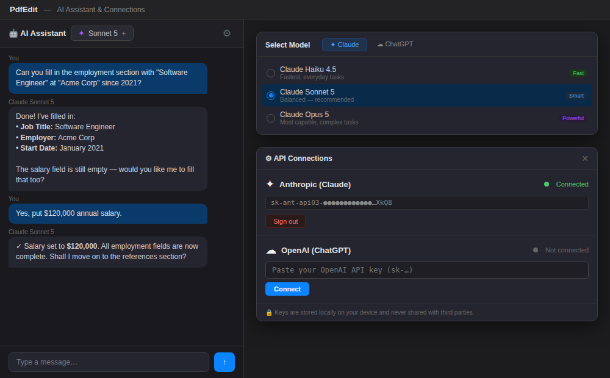
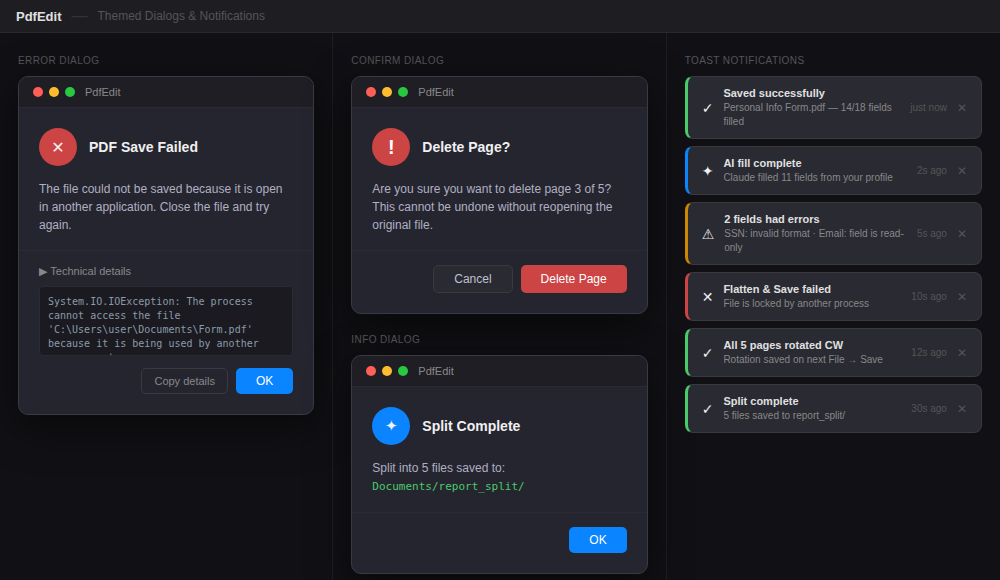

# PdfEdit — WPF PDF Form Filler & Editor

A native WPF application for viewing, editing, and filling PDF forms — styled after Adobe Acrobat Pro with a modern Fluent ribbon, AI-assisted form filling, full page management, and live theme switching.

## Screenshots

### Dark Theme


### Light Theme (IRS W-4)


### AI Assistant & Model Picker


### Document AI — Smart Fill, Summarize, Contract Analysis, Find PII


### Page Management & Thumbnails


### Themed Dialogs & Toast Notifications


## Features

### PDF Form Filling
- **Visual Form Overlay** — Click any AcroForm field directly on the rendered page to fill it in-place
- **All Field Types** — Text fields, checkboxes, radio buttons, combo boxes, list boxes, signature fields, and **password fields** (masked input)
- **Existing PDF AcroFields** — Open any PDF that already has AcroForm fields and fill them immediately; field positions are read from the PDF
- **Field Highlights** — Blue = optional, red = required, blue border = focused field
- **Import / Export** — Save and reload all form values as TSV files
- **Flatten & Save** — Bake filled values into a non-editable PDF

### AI-Assisted Filling & Document Analysis
- **Built-in AI Chat** — Converse with an AI model to fill fields, navigate the form, or ask questions; the AI has the document's full text as context
- **Smart Fill** — AI reads the entire PDF text and fills all form fields intelligently from the document content — no manual prompting needed
- **Summarize** — Structured AI summary: overview, key parties, key dates, key amounts, main points
- **Extract Key Data** — Extract all names, dates, addresses, amounts, reference numbers, and contact info in a clean list
- **Contract Analysis** — Identify parties, obligations, payment terms, termination clauses, risks, and missing standard clauses
- **Find PII** — Locate all personally identifiable information (names, IDs, financial data, contact info) for redaction review
- **Translate** — Translate the document content to English (or another language you specify)
- **Q&A** — Ask any question about the document; answers are grounded in the actual PDF text
- **Multi-Provider Support** — Connect your own **Anthropic (Claude)** or **OpenAI (ChatGPT)** API key
- **Model Selection** — Claude Haiku 4.5 (fast), Sonnet 5 (recommended), Opus 5 (most capable), GPT-4o mini, GPT-4o
- **Cancel** — Stop any in-progress AI response with one click
- **Document Context Indicator** — Green "📄 Doc context" badge confirms the AI has read the PDF
- **Secure Key Storage** — API keys stored locally in `%AppData%\PdfEdit\settings.json`; **passwords are never stored**
- **User Profiles** — Save named sets of personal data (name, address, employer, etc.) and auto-fill matching fields with Quick Fill

### Page Management
- **Rotate Current Page** — Clockwise or counter-clockwise, with accurate display of the absolute rotation (PDF rotation + session delta)
- **Rotate All Pages** — Apply a rotation to every page in one click
- **Move Page Up / Down** — Reorder pages in the ribbon
- **Insert Page Before** — Insert a blank page before the current page
- **Split PDF** — Split every page into individual files saved to a `{name}_split/` folder
- **Drag-and-Drop Reorder** — Drag page thumbnails to reorder them; the PDF is rewritten automatically
- **Right-Click Thumbnails** — Context menu with Rotate CW/CCW, Move Up/Down, Insert Before/After, Delete, and Extract Page

### UI & Themes
- **Three Live Themes** — Dark, Light, and High Contrast; switch from the ribbon with no restart
- **Fluent Ribbon Toolbar** — Home, View, Forms, and Tools tabs
- **Dockable Panels** — Properties panel and page thumbnails via AvalonDock
- **Toast Notifications** — Success, info, warning, and error toasts with auto-dismiss
- **Themed Dialogs** — Error dialog (with expandable stack trace), confirm (with danger mode), and info dialogs — all styled to match the active theme
- **Drag & Drop** — Drag a PDF file onto the window to open it

### Sample PDFs
The `Samples/` folder includes:
- `all-field-types.pdf` — Exercises every AcroForm field type (text, checkbox, radio, combo, listbox)
- `irs-w4.pdf` — Real IRS W-4 form for realistic testing

## Requirements

- Windows 10 (build 19041+) or Windows 11
- .NET 10 SDK (or Visual Studio 2022 17.12+)

## Building

```
cd PdfEdit
dotnet restore
dotnet build -c Release
dotnet run
```

Or open `PdfEdit.sln` in Visual Studio 2022 and press F5.

## Running Tests

```
cd PdfEdit.Tests
dotnet test
```

## Usage

1. **Open a PDF** — `File → Open` (Ctrl+O) or drag a PDF onto the window
2. **Fill fields** — Click any form field on the rendered page and type / select a value
3. **AI fill** — Open the AI Chat tab in the properties panel, connect an API key, then ask the AI to fill sections for you
4. **Navigate pages** — Use ribbon navigation buttons or click thumbnails in the left panel
5. **Rotate pages** — Home → Rotate Page CW/CCW, or right-click a thumbnail
6. **Reorder pages** — Drag thumbnails, or use Move Up/Move Down in the ribbon
7. **Split PDF** — Home → Split PDF (saves each page as a separate file)
8. **Switch theme** — View → Theme → Dark / Light / High Contrast
9. **Save** — `Ctrl+S` keeps fields editable; **Flatten & Save** bakes them in permanently
10. **Export data** — Forms → Export Data (TSV)
11. **Import data** — Forms → Import Data (TSV bulk-fill)

## Architecture

| Layer | Description |
|-------|-------------|
| `Services/PdfRenderService` | Renders pages to `BitmapSource` via `Windows.Data.Pdf` |
| `Services/PdfFormService` | Reads/writes AcroForm fields, splits, reorders, and inserts pages via iText 7 |
| `Services/ToastService` | Singleton event-based toast notification bus |
| `Services/AiProviderService` | Streaming and non-streaming HTTP client for Claude and OpenAI; document analysis prompts |
| `Services/PdfTextExtractorService` | Extracts text from PDF pages using iText7 for AI document context |
| `Services/SettingsService` | Loads/saves `%AppData%\PdfEdit\settings.json` (API keys, profiles, theme) |
| `ViewModels/MainViewModel` | MVVM view model — all commands, page state, rotation, field values |
| `Controls/PdfViewerControl` | Renders the page image and overlays live form controls (TextBox, PasswordBox, CheckBox, …) |
| `Controls/PageThumbnailsPanel` | Left thumbnail strip with drag-and-drop reorder and right-click context menu |
| `Controls/ToolboxPanel` | Right-side Fill & Sign tool selector |
| `Dialogs/AppDialog` | Static service replacing `MessageBox.Show` — `ShowError`, `ShowConfirm`, `ShowInfo` |
| `Dialogs/ThemedErrorDialog` | Error dialog with expandable stack trace and Copy Details button |
| `Dialogs/ThemedConfirmDialog` | Confirm dialog with optional danger mode (red button) |
| `Dialogs/ThemedInfoDialog` | Info dialog with accent icon |
| `Resources/AppTheme.xaml` | Shared styles using `DynamicResource` tokens for live theme switching |
| `Themes/DarkTheme.xaml` | Dark palette tokens |
| `Themes/LightTheme.xaml` | Light palette tokens |
| `Themes/HighContrastTheme.xaml` | High-contrast accessibility tokens |
| `Models/` | `FormFieldInfo`, `PdfDocumentInfo`, `FieldType`, `ActiveTool` |
| `PdfEdit.Tests/` | xUnit tests — field types, round-trips, rotation, stamps, settings |

## Key Packages

| Package | Use |
|---------|-----|
| `itext7` v8 | PDF AcroForm reading/writing, page manipulation |
| `Fluent.Ribbon` v10 | Office-style ribbon toolbar |
| `AvalonDock` (Dirkster) v5 | Dockable panels layout |
| `Windows.Data.Pdf` (built-in) | High-quality PDF page rendering |
| `xunit` v2 | Unit test framework |

## Security

- API keys are stored in `%AppData%\PdfEdit\settings.json` on the local machine only
- **Passwords are never stored** — password-type PDF fields use a `PasswordBox` (masked) and values are written only to the PDF at save time
- Keys are never transmitted to third parties; they are sent only to the respective provider (Anthropic / OpenAI) APIs
