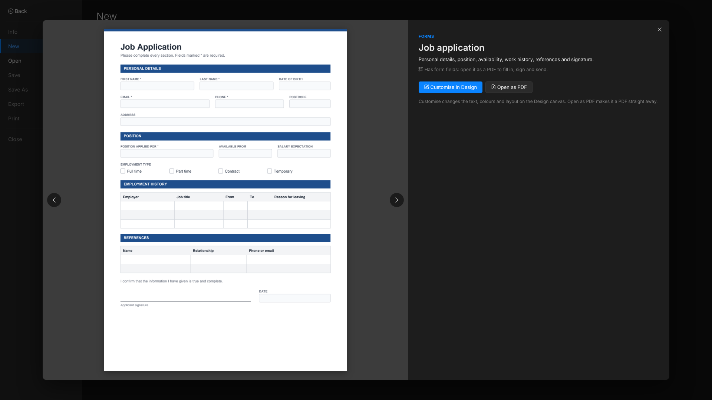
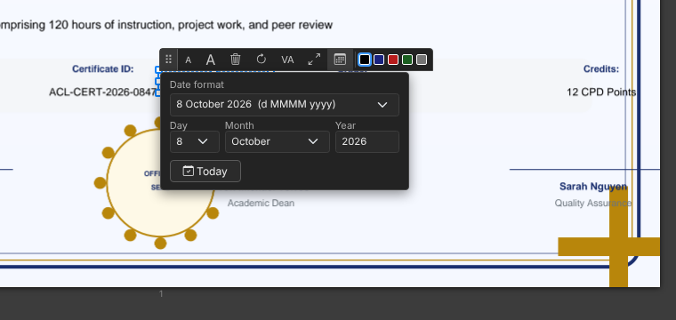
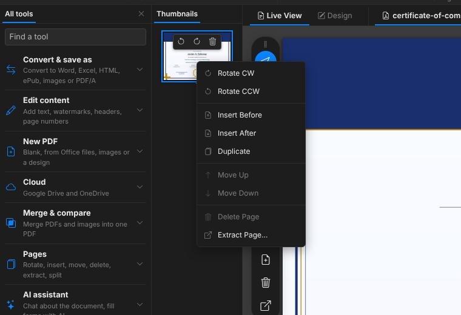
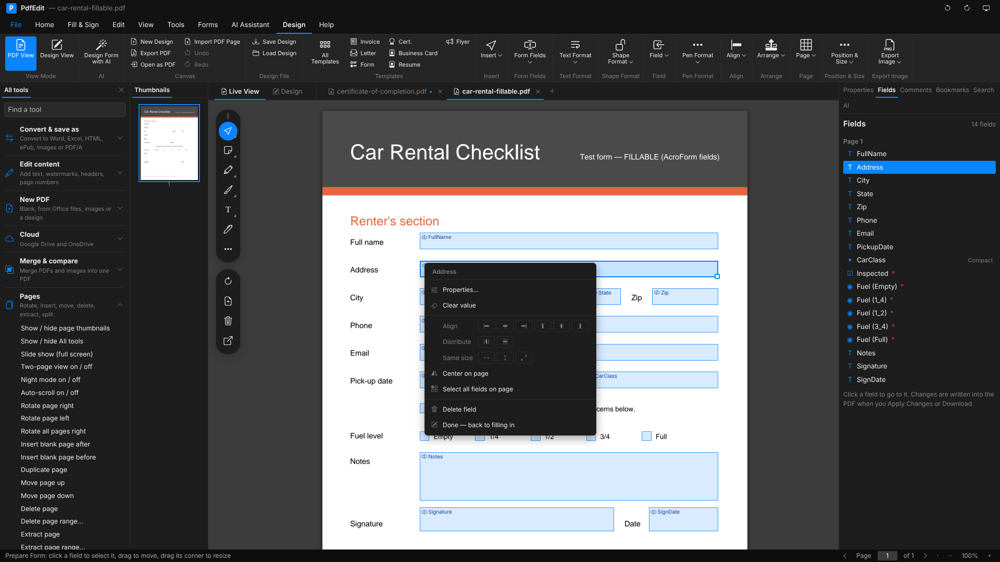
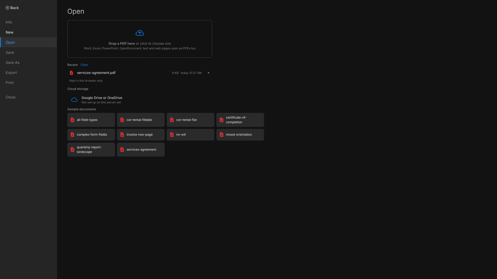
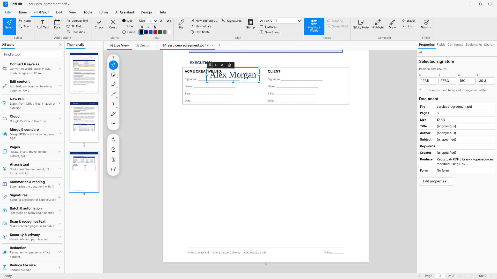

<p align="center">
  
</p>

<h1 align="center">PdfEdit</h1>

<p align="center">A free PDF editor for Windows, built to rival Adobe Acrobat. No ads, no subscriptions, no paywalls.</p>

<p align="center">
  <a href="https://github.com/dotnetappdev/Pdfedit/releases/latest"></a>
  <a href="https://github.com/dotnetappdev/Pdfedit/actions/workflows/ci.yml?query=branch%3Adevmain"></a>
  
  <a href="LICENSE"></a>
  <a href="https://dotnetappdev.github.io/Pdfedit/docs/index.html"></a>
</p>

<p align="center">
  <a href="https://dotnetappdev.github.io/Pdfedit/"><b>Website</b></a> |
  <a href="https://dotnetappdev.github.io/Pdfedit/download.html"><b>Download</b></a> |
  <a href="https://dotnetappdev.github.io/Pdfedit/docs/index.html"><b>User guide</b></a> |
  <a href="https://dotnetappdev.github.io/Pdfedit/tutorials/index.html"><b>Tutorials</b></a> |
  <a href="https://dotnetappdev.github.io/Pdfedit/whats-new.html"><b>What's new</b></a>
</p>

## Why PdfEdit?

You open a form, click to type into it, and get asked to upgrade. You want to merge two files, and that's a paid feature. A "free" editor turns out to watermark every page, or cap you at three documents a day. Acrobat Reader lets you look at a PDF, but doing almost anything with it means a monthly subscription.

PdfEdit is the PDF editor I wanted instead: everything included, nothing locked, no account, no ads and no watermarks. It works offline and your files stay on your PC.

## What it can do

Fill in and sign any form, even a flat scan with no fields, and send it back. Highlight, comment, stamp and redact, with your own stamps alongside Acrobat's. Move, resize, replace or delete the pictures already in a PDF, or snapshot any area as an image. Rotate, reorder, merge, split and resize pages, convert to greyscale, and print several pages per sheet or as a folded booklet. Scan straight to a searchable PDF and turn Word documents into fillable forms. Start from one of 70 templates (invoices, quotes, fillable forms, agreements, letters, resumes, flyers, certificates, calendars and planners) in a gallery like Office's, then customise it or open it as a PDF to fill in.

Open Word, Excel, PowerPoint, text, Markdown and HTML files as PDFs, and save PDFs as Word, Excel, PowerPoint, HTML, Markdown or ePub. Batch-process a folder, fill a form from every row of a spreadsheet, and save to Google Drive or OneDrive. Read hands-free with read aloud and auto-scroll, and set it up the way you need: text sizes, a high-contrast focus ring, reduced motion and a voice that reads things out. There's an optional AI assistant if you want one, and it can run on a free local model.

<p align="center"><a href="docs/tour.md"></a></p>

**[Download](https://github.com/dotnetappdev/Pdfedit/releases/latest)** for Windows 10 (2004+) and 11, 64-bit: installer or portable zip.

**[Features](docs/features.md)** | [Video tour](docs/tour.md) | [Screenshots](docs/screenshots.md) | [Documentation](docs/) | [Themes](docs/themes.md) | [Web version (Blazor)](#blazor-web-version) | [Accessibility](docs/accessibility.md) | [Keyboard shortcuts](docs/keyboard-shortcuts.md) | [Building](docs/building.md)

## Screenshots

### Blazor web version

**PdfEdit.Blazor** is PdfEdit in the browser: a Blazor Web App (.NET 10) with the same ribbon
(the same nine tabs, groups and commands, everything that can work in a browser), panels, All tools
pane and themes as the Windows app, running PdfEdit.Core and the Pdfium renderer on the
server. Fill and sign forms, prepare and design forms, stamps, drawing and measuring, OCR,
compare, certificate signing, the AI assistant and Translate PDF, batch processing and bulk fill,
Google Drive and OneDrive, Office files to PDF, several documents open at once, and the
floating toolbox beside the pages.
How to run it and what it needs on the server: [PdfEdit.Blazor/README.md](PdfEdit.Blazor/README.md).

**Drafts: reloading the page doesn't lose your work.** Open documents, things placed on them but not applied yet, field values and the Design canvas are kept in the browser as you go (and at once with Save Draft), and come back after a reload; drafts from a closed window wait on the start page.

**Templates: 70 to start from, in a gallery like Office's (File > New)**




**The start page: recent files and featured templates**


**Everything you add has the Windows app's floating toolbar: smaller, larger, delete, rotate, spacing, fit and colours**


**Dates change format, day, month and year in place**



**Right-click anything on the page**


**Properties for the selected item, with Lock**


**Comments: review status, checkmarks, notes and replies, saved in the PDF**


**Thumbnails: rotate and delete on hover, a right-click menu, and drag to reorder**



**Edit Fields: align, space and size fields from the right-click menu**



**The File menu follows the dark theme**



**The Tools tab and the floating toolbox: highlight, underline, strikethrough, rectangle, arrow, cloud, callout, sticky note, stamp and a measurement on a page**


**Floating toolbox: Draw tools with ink colours**


**Comment tools: sticky note, callout, insert and replace text, stamps**


**Highlight tools: highlight, underline, squiggly, strikethrough, with colours**


**Sign: saved signatures and initials, or sign with a certificate**


**Signatures and pictures stay editable after Apply changes, saving or reopening**



**More tools: measure, navigate, fill, shapes and form fields**


**Toolbox tools on a page: callout, insert and replace text, highlights, clouds, polygons, marks, vertical text and initials**


**Design toolbox with the grid on, and an invoice template**


**The ribbon, tab by tab, as in the Windows app**


**A narrower window: groups fold into drop-downs, like the Fluent ribbon**


**All tools pane, docked on the left beside the thumbnails as in the Windows app (Dracula theme)**


**Office theme**


**Select Text: copy, highlight or ask the AI about it**


**Edit Images: move, resize, replace, save or delete a picture in the PDF**


**Mind Map of the document (AI Assistant)**


**Design templates (Invoice)**


**Take the Tour**


**Fill in and sign forms (Light theme)**


**Dark theme**


**High Contrast theme**


**Stamps, freehand drawing, arrows and measuring**


**Design a fillable form on the design canvas**


**Text and stamps placed upright on a rotated page, with several documents open as tabs**


**Batch Process: OCR, watermark, Bates numbers and compress over many PDFs**


**Bulk Fill: one filled form per spreadsheet row**


**Open from and save to Google Drive and OneDrive**


**Translate PDF: before**


**Translate PDF: after, with the layout and colours kept**


### Cross-platform desktop (Avalonia)

**PdfEdit.Avalonia** runs the web version inside a desktop window on Windows, macOS and Linux, with the same ribbon,
tools and drafts, with the system's Save dialog, your PDF viewer for printing, and PDFs opened from the
command line or Open with. The program is called PdfEdit, like the Windows app. It hosts the web app in its own process on
a private local address that only its window can use, and shows it in WebView2, WebKit or WebKitGTK
([how to build and run it](docs/building.md#the-cross-platform-desktop-app-windows-macos-linux)).

### Desktop (Windows) version


<table>
  <tr>
    <td width="50%"></td>
    <td width="50%"></td>
  </tr>
</table>

#### Desktop themes

PdfEdit follows your Windows light, dark or contrast theme, or you can pick one of twelve. [More about themes](docs/themes.md).

<table>
  <tr>
    <td align="center"><br>Light</td>
    <td align="center"><br>Dark</td>
    <td align="center"><br>High contrast</td>
  </tr>
  <tr>
    <td align="center"><br>Office</td>
    <td align="center"><br>Dracula</td>
    <td align="center"><br>Nord</td>
  </tr>
</table>

<table>
  <tr>
    <td width="66%"><br><p align="center">All twelve themes</p></td>
    <td width="34%"><br><p align="center"><a href="docs/accessibility.md">Accessibility settings</a></p></td>
  </tr>
</table>

More in the [screenshot gallery](docs/screenshots.md).

## Updates

**Help > Check for Updates** (on the Help tab, or File > Help) looks at the [GitHub releases](https://github.com/dotnetappdev/pdfedit/releases) for a newer version. It picks the download that matches how PdfEdit was installed (setup EXE, portable ZIP or MSIX), lets you choose where to save it, shows a progress bar while it downloads, and checks the file against its SHA-256. Then it installs the update. By default it closes PdfEdit (and any other PdfEdit windows) first and starts it again afterwards. Your unsaved work is kept, as it is on any normal close. Each time PdfEdit starts it also checks for a new version. If there is one, it shows the version and a link to it on GitHub, with **See release notes**, and asks **Yes, update** / **No** (skip this version) / **Cancel** (ask again next time). **Help > About PdfEdit** has a **Check for Updates...** button too. You can turn the startup check off, or include pre-releases, in the update window. The setup program checks for a version that's already installed and uninstalls it first, then installs the new one in the same folder. Your settings, signatures, stamps and recent files are kept.

## Build from source

```bash
git clone https://github.com/dotnetappdev/Pdfedit.git
cd Pdfedit
dotnet run --project PdfEdit
```

The cross-platform desktop app (Windows, macOS and Linux) is `dotnet run --project PdfEdit.Avalonia`: an
Avalonia window showing the web version in the system's web view. See [Building](docs/building.md).

Needs the .NET 10 SDK. Bugs and ideas go in [issues](https://github.com/dotnetappdev/Pdfedit/issues); pull requests go to the `devmain` branch.

## License

[MIT](LICENSE). PDF processing uses [iText 7](https://itextpdf.com/), which is licensed under the AGPL.
