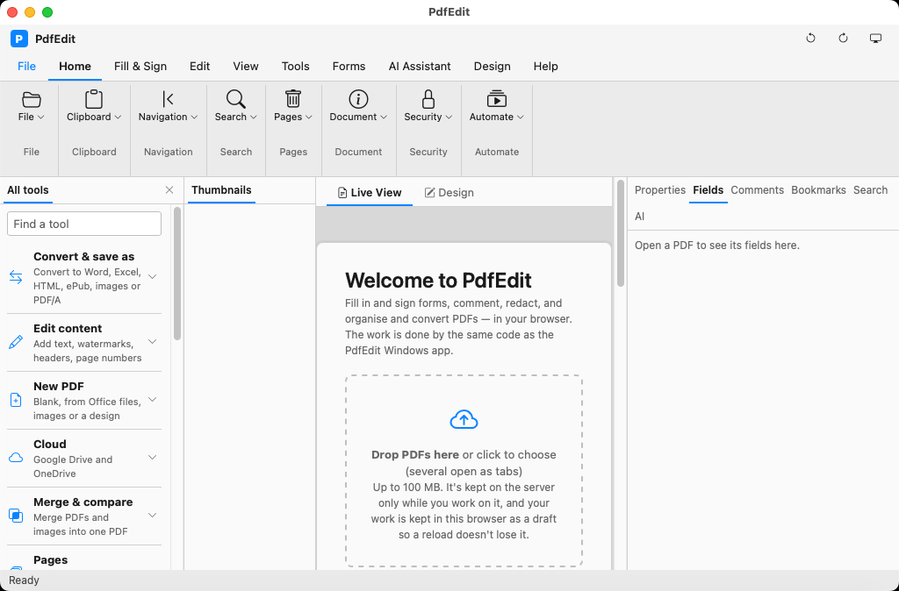
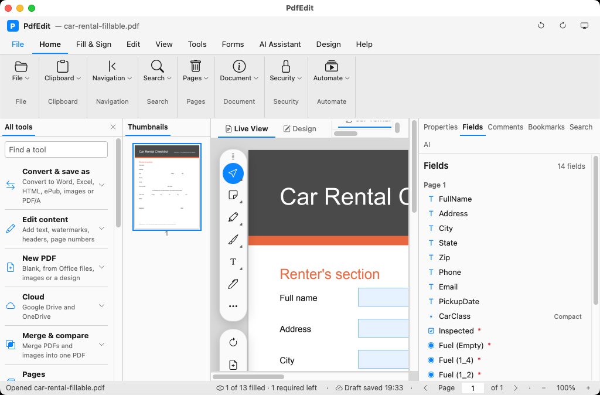
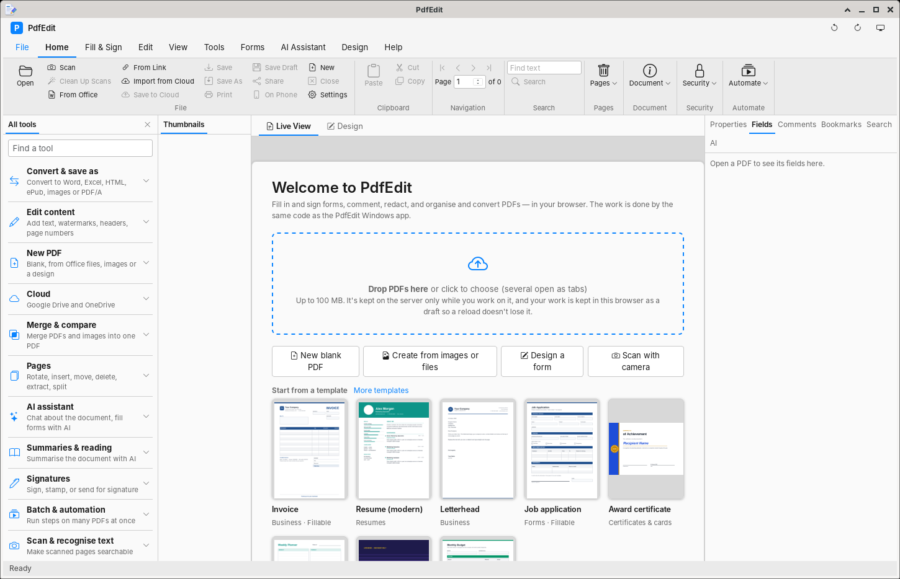
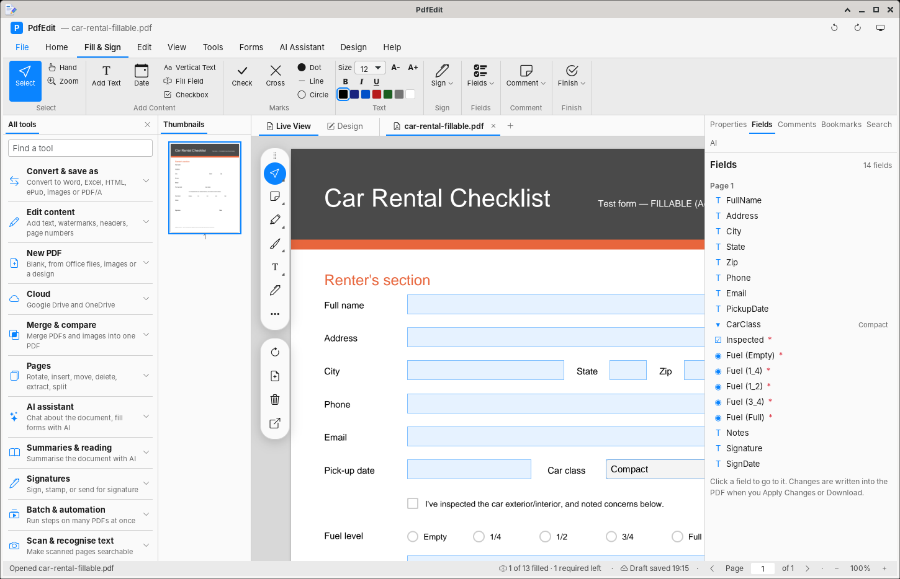

# Screenshots

[Back to README](../README.md)

The Windows pictures below are rendered mock-ups of the interface rather than captures of the running app, so small details may differ. The ribbon and form-filling images are drawn from the real ribbon layout and can be regenerated with `node docs/screenshots/src/render.mjs`.

## PdfEdit for Mac and Linux

These are captures of the real app. PdfEdit for Mac and Linux shows the same screens as the web version, in its own window.

**Mac**

**Linux**

## The ribbon

**Fill & Sign**: everything for filling in and signing a form in one place.

**Home**: files, navigation and page tools.

**Tools**: mark-up, drawing, measuring and stamps.

**Edit**: form data, adding form fields and lining them up.

## Filling in forms

Filling in, ticking and signing a flat form in Live View, start to finish:

Text that doesn't fit its box: the **Fit** menu wraps it and grows the box instead of cutting it off.

Ticks and crosses in a flat form's checkboxes. Click inside a square and the mark fills it.

Dates can be switched to another format, or have the day, month and year changed, from the Properties panel.

Stamps from Acrobat's standard set and more, including dynamic stamps that add your name and the time.

Signing: pick a saved signature or initials and click where they go.

## Around the app

| Dark theme | Light theme |
|---|---|
|  |  |

| Filling a form | Comments and stamps |
|---|---|
|  |  |

| Field properties | Editing fields |
|---|---|
|  |  |

| Design canvas | AI assistant |
|---|---|
|  |  |

| All tools | High contrast |
|---|---|
|  |  |

| Settings > Accessibility |
|---|
|  |

Sample PDFs (a two-page invoice, a landscape report, a certificate and a mixed-orientation document) are in the `Samples` folder:

## Web version (Blazor)

PdfEdit in the browser ([PdfEdit.Blazor](../PdfEdit.Blazor/README.md)): the same ribbon, panels and themes.

| | |
|---|---|
|  New)"> |  |
| Templates (File > New) | Template preview |
|  |  |
| Recent files and featured templates | Floating toolbar on anything you add |
|  |  |
| Right-click menus | Properties and Lock |
|  |  |
| Comments: status, checkmarks, replies | Edit Fields: align, space, size |
|  |  |
| Thumbnail menu, rotate, drag to reorder | Date format, day, month, year |
|  | |
| Signatures and pictures stay editable after saving | |
|  |  |
| Light | Dark |
|  |  |
| High contrast | Stamps, drawing and measuring |
|  |  |
| Design a form | Rotated pages and document tabs |
|  |  |
| Batch process | Bulk fill from a spreadsheet |
|  |  |
| Google Drive and OneDrive | Translate PDF, keeping layout and colours |
