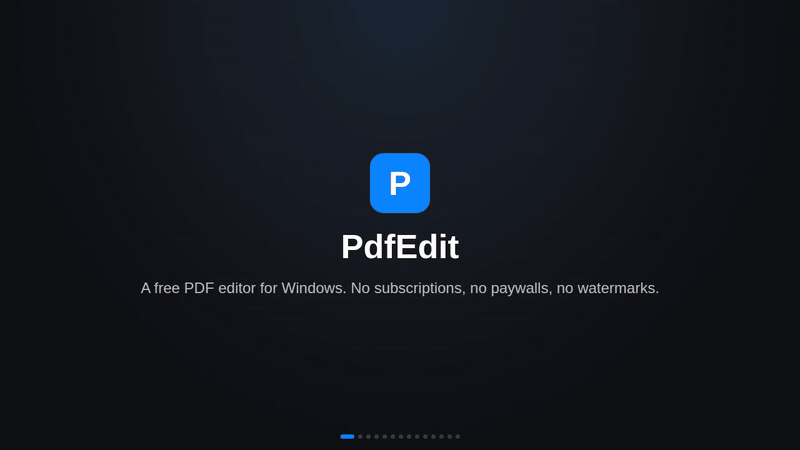

# Video tour

[Back to README](../README.md)

A 70-second look around PdfEdit: filling and signing forms, marking up, building forms, organising pages, the design canvas, the AI assistant, themes and accessibility.

**[Download the MP4](tour/pdfedit-tour.mp4)** (1280x720, 2 MB) for full quality.

The tour is put together from the same mock-ups as the [screenshots](screenshots.md), so it can be rebuilt whenever the app changes: `node docs/screenshots/src/tour.mjs` (needs Playwright and ffmpeg).
