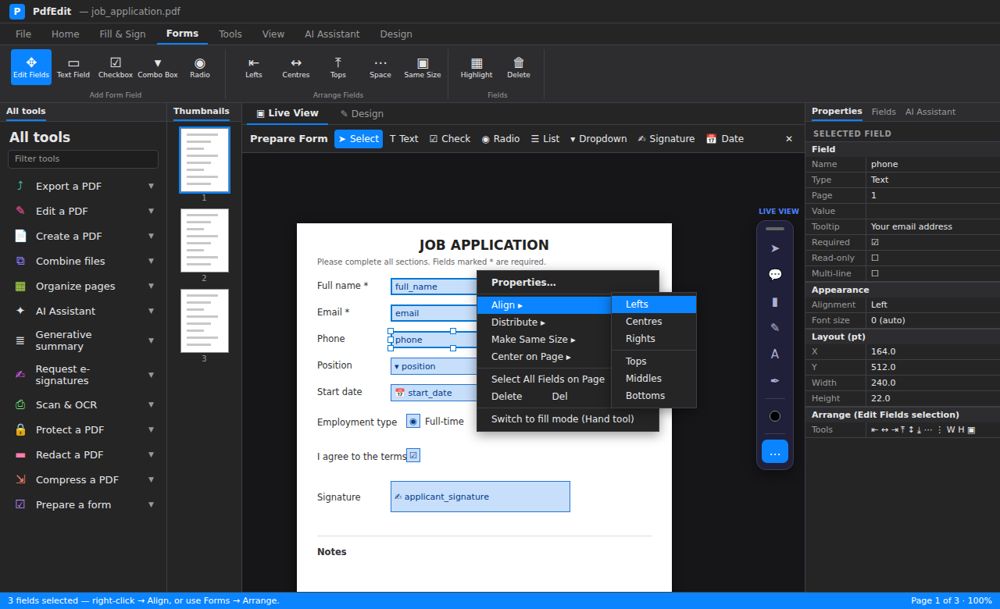
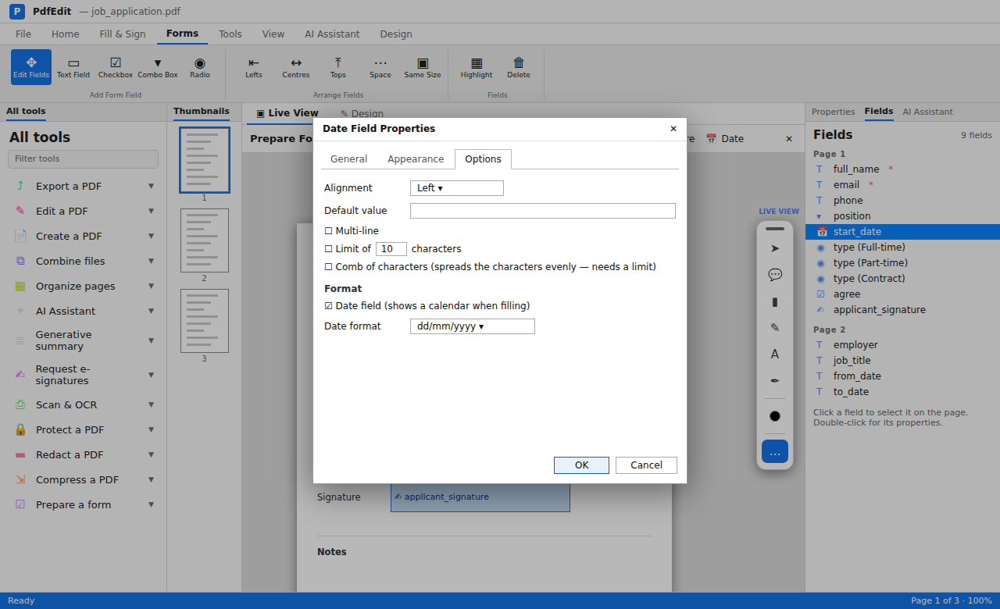

A fillable form has real fields that anyone can click and type into, in any PDF reader. PdfEdit can find the blanks on a flat form for you, and you can add, move and set up fields by hand.

## Open the flat form

Open the PDF. It can be a form made in Word and saved as PDF, or a scanned paper form.

> **Tip:** got the form as a Word document? Open the `.docx` in PdfEdit instead. Content controls, ☐ boxes and `______` blanks become fields automatically.

## Let PdfEdit find the fields

Click **Detect Fields** (Edit tab). PdfEdit looks for boxes, blank lines, check boxes and signature lines, names each field after the label beside it, and lists what it found.

Untick anything you don't want, fix any names, then click **Add**.

## Check the fields

Click **Edit Fields** on the Edit tab (on Windows you can also use **Prepare Form** or press **E**). Each field shows as a named box.

- **Drag** a field to move it. Drag a **handle** to resize it.
- **Arrow keys** nudge by 1 point, or 10 with Shift.
- Select several fields (**Ctrl+click** or drag a box round them), then right-click to **Align**, **Distribute** or **Make Same Size**.

## Add any fields it missed

Pick a field type from the toolbar: **Text**, **Check Box**, **Radio Button**, **List Box**, **Dropdown**, **Date** or **Signature**. Then click the page to drop one, or drag to size it.

For a group of radio buttons (for example *Yes / No*), give them the same group name so only one can be chosen.

## Set the options

Double-click a field (or use **Field Properties**) to set:

- **General**: name, tooltip, **Required**, read only
- **Appearance**: border, fill, font size and colour
- **Options**: alignment, default value, multi-line, character limit, comb (one letter per box), date format, list choices

For numbers, set a **Format** (number, currency, percentage or date), and use **Calculate** to add up or multiply other fields, for example a total on an order form.

## Test it

Click **Apply Changes** (or switch back from Edit Fields), then fill the form in yourself. Press **Tab** to check the fields go in a sensible order.

## Save

**Save** writes the fields into the PDF. Date fields use Acrobat's own scripts, so the form behaves the same in Adobe Reader.

## What's next

- [Fill a form for every row of a spreadsheet](bulk-fill-from-a-spreadsheet.md)
- [Preparing forms](forms.md) in the user guide
